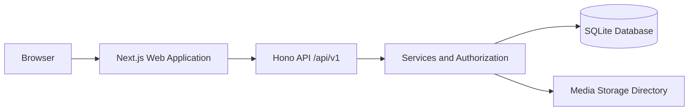
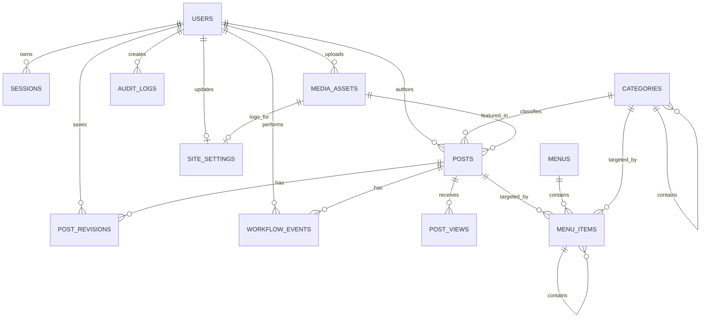
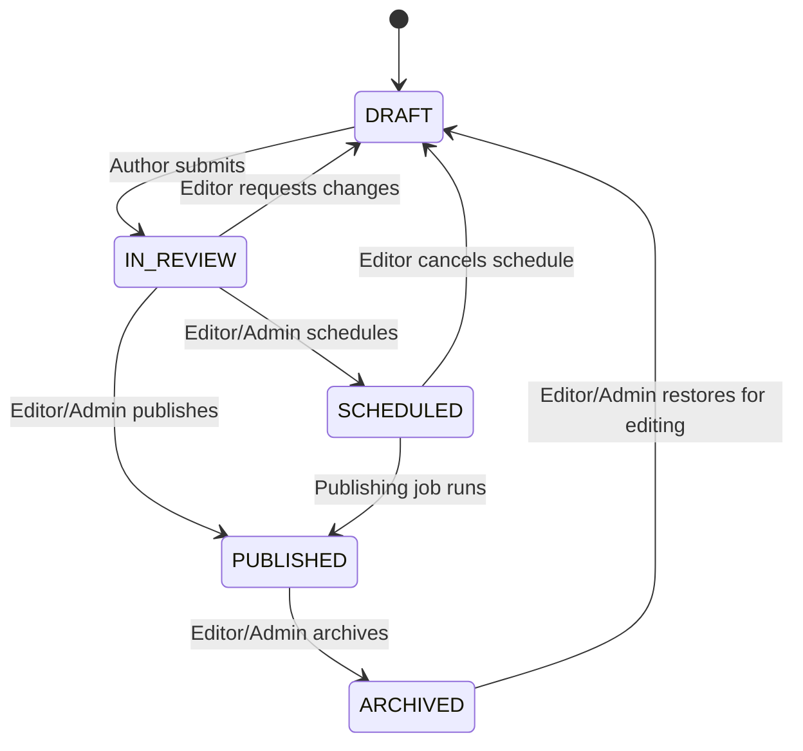

# PublishFlow CMS — Claude Code Master Build Specification

> **Single source of truth for generating the complete repository.**
>
> This document is intentionally implementation-oriented. It contains the product requirements, architecture, database model, API contracts, UI behavior, security rules, tests, Docker setup, seed data, quality gates, and the instructions an autonomous coding agent must follow.

---

## 0. How to Use This File with Claude Code

Place this file in an empty project directory, start Claude Code from that directory, and give it this instruction:

```text
Read CMS_CLAUDE_CODE_MASTER_SPEC.md completely, then build the full project in this directory exactly as specified. Do not stop after planning or scaffolding. Implement the application, migrations, seed data, tests, Docker files, CI workflow, and documentation. Run every quality command, fix all failures, and finish with a concise completion report containing commands, demo accounts, and any clearly documented limitations.
```

This file can also be renamed to `PROJECT_SPEC.md`. Do **not** use this entire long document as the root `CLAUDE.md`; after generating the repository, create a concise project-level `CLAUDE.md` that contains only stable commands and coding conventions and links to this specification.

### Expected starting conditions

The coding agent must support both cases:

1. **Empty directory:** initialize the complete repository.
2. **Partially initialized repository:** inspect existing files first, preserve correct work, then complete or refactor it to satisfy this specification.

The agent must not require WordPress, Joomla, PHP, an external database, paid APIs, cloud credentials, or third-party authentication services.

---

## 0.1 Agent Role and Non-Negotiable Instructions

Act as the senior full-stack engineer responsible for delivering a reviewable take-home assignment, not as an assistant that only writes examples.

### Required behavior

- Read this document before changing code.
- Build the application in the current directory.
- Use a single Git repository and one lockfile.
- Use `pnpm` consistently.
- Implement working vertical slices, not disconnected mock screens.
- Keep route handlers thin and put permissions and business rules in server services.
- Add database constraints even when the same rule is validated in TypeScript.
- Use real SQLite persistence, real password hashing, real server-side sessions, and real file validation.
- Run migrations and seed data against a clean database.
- Run linting, type checking, unit tests, integration tests, production build, and E2E tests.
- Fix failures instead of documenting them as future work.
- Keep the public website and admin dashboard usable on desktop and mobile.
- Produce a polished `README.md` that lets an interviewer run the project without reading source code first.
- Record important trade-offs in `docs/architecture-decisions.md` or the README.

### Forbidden shortcuts

- Do not stop after generating folders, schemas, or placeholder pages.
- Do not leave `TODO`, `FIXME`, empty handlers, fake buttons, fake analytics, or hard-coded successful API responses.
- Do not use an in-memory array as the main data source.
- Do not store plaintext or reversibly encrypted passwords.
- Do not trust client-supplied roles, author IDs, status, reads, publication dates, filenames, MIME types, or sort columns.
- Do not perform authorization only in React components.
- Do not expose stack traces, SQL statements containing sensitive values, password hashes, session tokens, or raw secrets.
- Do not use `dangerouslySetInnerHTML` with untrusted content.
- Do not use the Edge runtime for routes that access SQLite, Argon2, or the local filesystem.
- Do not deploy a local SQLite file or local uploads to an ephemeral serverless filesystem and claim persistence works.
- Do not add microservices, message brokers, Redis, Elasticsearch, or Kubernetes to this assignment.
- Do not replace Hono with Next.js-only API handlers; Hono is a required part of the solution.
- Do not implement the project using WordPress, Joomla, or PHP. They are product references only.

### Handling ambiguity

The explicit decisions in Section `0` and the implementation appendices at the end of this document override any earlier broad recommendation. When a minor detail remains unspecified, choose the simplest secure solution that matches the architecture, document the decision, and continue without blocking the build.

---

## 0.2 Definition of a Complete Delivery

The project is considered complete only when all of the following exist and work together:

- Public website with home, post, category, and search pages.
- Secure staff login/logout and authenticated admin shell.
- Admin, Editor, and Author roles with server-enforced permissions.
- User administration.
- Category administration.
- Post creation, editing, review, publication, scheduling, archiving, and restoration.
- Optimistic concurrency control.
- Revision history with preview, comparison, and restoration.
- Header and footer menu management with ordering and nesting.
- Site settings and logo management.
- Image media library with secure upload validation.
- Meaningful de-duplicated post read counting.
- Audit log.
- Dashboard metrics.
- SQLite migrations, deterministic seed data, and database integrity checks.
- Versioned Hono API under `/api/v1` with consistent errors and OpenAPI JSON/UI.
- Unit, integration, and Playwright E2E tests for critical flows.
- Docker image, Compose configuration, persistent volumes, and backup instructions.
- GitHub Actions quality workflow.
- `.env.example`, `README.md`, architectural documentation, and demo credentials.
- Zero TypeScript errors, zero lint errors, passing tests, and a successful production build.

P2 polish items remain optional only after every required item above passes.

---

## 0.3 Authoritative Technology Decisions

Use the latest **stable, non-RC, mutually compatible** versions available at implementation time, then pin the exact resolved versions in `pnpm-lock.yaml`. Do not copy version numbers from this document if a newer stable compatible release exists.

| Area | Required choice |
|---|---|
| Runtime | Node.js 24 LTS; use `24` in `.nvmrc` and a compatible Node 24 range in `package.json#engines` |
| Package manager | `pnpm` |
| Language | TypeScript with `strict: true`, `noUncheckedIndexedAccess: true`, and no unjustified `any` |
| Web framework | Next.js 16.3.x App Router using the latest secure patch in that stable line |
| HTTP API | Hono mounted at `src/app/api/[[...route]]/route.ts` |
| Runtime for API/database | Node.js runtime, never Edge |
| Database | SQLite file |
| Database layer | Drizzle ORM + Drizzle Kit + `better-sqlite3` |
| Validation/contracts | Zod; use shared schemas at API boundaries |
| API documentation | `@hono/zod-openapi` and Swagger UI or an equivalent Hono-compatible OpenAPI UI |
| Authentication | Opaque database-backed session cookie |
| Password hashing | Argon2id |
| Styling | Tailwind CSS with accessible reusable components |
| Admin data fetching | Same-origin Hono API; TanStack Query is recommended |
| Forms | React Hook Form + Zod resolver or equally robust typed forms |
| Content format | Markdown stored as text; raw HTML disabled |
| Markdown rendering | `react-markdown` + `remark-gfm`; no unsafe raw HTML plugin |
| Testing | Vitest for unit/integration and Playwright for E2E |
| Containerization | Multi-stage Docker build using Next.js standalone output |
| CI | GitHub Actions |

### Required Hono/Next.js integration shape

The Hono application must be defined under `src/server/http/app.ts` and adapted in the App Router catch-all route.

```ts
// src/app/api/[[...route]]/route.ts
import { handle } from 'hono/vercel';
import { app } from '@/server/http/app';

export const runtime = 'nodejs';
export const dynamic = 'force-dynamic';

const handler = handle(app);

export {
  handler as GET,
  handler as POST,
  handler as PUT,
  handler as PATCH,
  handler as DELETE,
  handler as OPTIONS,
};
```

The Hono app must use `.basePath('/api/v1')`. Keep this adapter file small.

### Required SQLite connection configuration

On initialization of the single server-side connection, enable:

```sql
PRAGMA foreign_keys = ON;
PRAGMA journal_mode = WAL;
PRAGMA synchronous = NORMAL;
PRAGMA busy_timeout = 5000;
```

Add `better-sqlite3` to `serverExternalPackages` in `next.config.ts` when required by the installed Next.js version. Mark database modules with `import 'server-only'` so they cannot enter client bundles.

---

## 0.4 Mandatory Feature Priority

Implement in this order, but do not treat later stages as optional:

1. Foundation, migrations, seed, authentication, sessions, RBAC.
2. Categories and posts with Draft CRUD.
3. Optimistic locking and revisions.
4. Editorial workflow and audit events.
5. Public website and read de-duplication.
6. Menus, settings, media, and dashboard.
7. Scheduled publishing, FTS5 search, SEO, sitemap, and OpenAPI documentation.
8. Tests, Docker, CI, accessibility, documentation, and final verification.

A feature is not finished until its UI, API, service rule, persistence, authorization, loading/error/empty states, and relevant tests are implemented.

---

## 0.5 Product and UI Quality Bar

The finished application should look like a purposeful editorial product rather than a generated CRUD dashboard.

- Use a clean neutral/blue design with strong hierarchy and consistent spacing.
- Build a responsive admin shell with sidebar, top bar, breadcrumbs, current-user menu, and mobile navigation.
- Provide clear loading, skeleton, empty, success, validation, conflict, forbidden, and unexpected-error states.
- Use semantic HTML and visible keyboard focus.
- Do not rely on color alone for status.
- Use confirmation dialogs for destructive actions.
- Preserve list filters in the URL.
- Display dates in the site-configured timezone while storing UTC.
- Use accessible buttons for menu reordering; drag-and-drop may be added, but keyboard controls must remain available.
- Use a Markdown editor with a simple formatting toolbar, side-by-side or tabbed preview, unsaved-change warning, autosave only if implemented safely, and a clear version indicator.
- Ensure every control actually performs its advertised action.

---

## 0.6 Required Repository-Level Output

At minimum, the agent must create:

```text
.
├── CLAUDE.md
├── CMS_CLAUDE_CODE_MASTER_SPEC.md
├── README.md
├── IMPLEMENTATION_REPORT.md
├── .env.example
├── .gitignore
├── .nvmrc
├── package.json
├── pnpm-lock.yaml
├── next.config.ts
├── tsconfig.json
├── eslint.config.mjs
├── drizzle.config.ts
├── playwright.config.ts
├── vitest.config.ts
├── Dockerfile
├── docker-compose.yml
├── .dockerignore
├── .github/workflows/ci.yml
├── docs/
│   ├── architecture-decisions.md
│   ├── api.md
│   ├── security.md
│   └── demo-script.md
├── drizzle/
├── scripts/
├── src/
├── tests/
├── data/.gitkeep
└── uploads/.gitkeep
```

Generated database files, uploaded media, test artifacts, Playwright reports, coverage output, and local secrets must be ignored by Git.

---

## 1. Executive Summary

The original requirement describes a basic CMS with users, navigation items, categories, posts, and site settings. Implementing those entities as ordinary CRUD screens would satisfy the minimum requirement, but it would not demonstrate how a CMS solves real editorial problems.

This proposal turns the assignment into **PublishFlow CMS**, a focused CMS for a small company, academy, newsroom, or community whose content is written by multiple people and must be reviewed before publication.

The system solves these practical problems:

1. Authors should not be able to publish unreviewed content accidentally.
2. Two users editing the same post should not silently overwrite each other.
3. Previous versions of content should be recoverable.
4. Navigation should support ordering, nested items, categories, posts, and custom links.
5. Public read counts should not increase on every refresh.
6. Only published content should be visible publicly.
7. Administrators should know who published, archived, restored, or deleted content.
8. The application should remain easy to run locally and easy for an interviewer to review.

The result is intentionally smaller than WordPress or Joomla. It borrows useful CMS concepts—roles, revisions, menus, and editorial workflow—without attempting to build themes, plugins, comments, or a page builder.

---

## 2. Product Name and Problem Statement

### Product name

**PublishFlow CMS**

### Example real-world scenario

A small organization currently writes articles in documents and coordinates approval through chat messages. This creates several recurring problems:

- Drafts are published before approval.
- Editors cannot see what changed between versions.
- A user can overwrite another user's recent changes.
- Broken navigation links remain visible after content is archived.
- Refreshing a page inflates its read count.
- There is no clear history of who performed sensitive actions.

PublishFlow centralizes writing, review, publishing, navigation, settings, and basic analytics in one application.

---

## 3. Goals and Non-Goals

### Goals

- Provide secure email/password authentication.
- Provide role-based permissions for administrators, editors, and authors.
- Support a clear post lifecycle: draft, review, publication, and archive.
- Preserve revision history and allow safe restoration.
- Detect concurrent edits instead of losing data.
- Provide configurable header/footer navigation.
- Provide categories and a public content website.
- Track meaningful reads with basic refresh de-duplication.
- Provide a clean admin dashboard.
- Provide tests, migrations, seed data, and one-command local startup.

### Non-goals

The following are deliberately outside the core assignment:

- WordPress-compatible plugins or themes.
- A visual page builder.
- Comments and moderation.
- Multi-tenant or multi-site support.
- E-commerce.
- Localization and translation workflows.
- Complex analytics or advertising attribution.
- Real-time collaborative editing.
- A distributed microservices architecture.

Keeping these out of scope demonstrates prioritization rather than missing features.

---

## 4. User Roles

| Role | Main responsibility |
|---|---|
| **Admin** | Manages users, roles, site settings, menus, categories, media, and all posts. |
| **Editor** | Reviews, publishes, rejects, archives, and edits any post. Can manage categories and menus. |
| **Author** | Creates and edits their own drafts, previews them, and submits them for review. |
| **Public visitor** | Reads published content, browses categories, uses navigation, and searches posts. |

There is no public registration. An admin creates staff accounts.

---

## 5. Scope and Priority

Finish all **P0** items before starting P1 or P2 work.

### P0 — Required submission

- Authentication and logout.
- Admin, Editor, and Author roles.
- User management by Admin.
- Category CRUD.
- Post CRUD with ownership and permissions.
- Post workflow: Draft → In Review → Published → Archived.
- Revision history and restore.
- Optimistic locking using a post version number.
- Public home, category, and post pages.
- Header and footer menus with ordering and nested items.
- Site settings including logo and site name.
- Basic media upload for images.
- Read count de-duplication per browser per post per day.
- Filtering, pagination, and search in the admin post list.
- API validation and consistent error responses.
- Unit/integration tests for critical business rules.
- SQLite migrations and seed data.
- README, `.env.example`, and Docker support.

### P1 — Required differentiators in this master build

- Scheduled publishing.
- SQLite FTS5 full-text search with a safe fallback.
- Audit log screen.
- SEO title, description, Open Graph metadata, sitemap, and robots rules.
- Post preview that is visible only to authenticated staff.
- Dashboard statistics.
- Generated OpenAPI JSON and interactive API documentation.

### P2 — Optional polish after all quality gates pass

- Drag-and-drop menu ordering in addition to accessible keyboard controls.
- Tags and many-to-many post classification.
- Autosave.
- Password-reset email flow.
- Additional image thumbnails/responsive variants.
- Import/export posts as JSON or Markdown.
- Dark mode.

---

## 6. Improvements Over the Given Data Model

| Given requirement | Proposed model | Reason |
|---|---|---|
| `Users(id, Email, password)` | `users` with `password_hash`, name, role, status, timestamps | Passwords must never be stored directly; roles and account status are necessary for a real CMS. |
| `NavMenu(Id, Title, Position, url)` | `menus` + `menu_items` | Supports header/footer menus, nested items, reordering, and links to posts/categories/custom URLs. |
| `Categories(id, Title, Description)` | Add slug, parent category, active flag, timestamps | Enables clean URLs, optional hierarchy, and safe hiding without deletion. |
| `Posts(Id, CategoryId, Subject, Content, Source, Reads)` | Add author, slug, workflow status, version, revisions, SEO fields, timestamps | Solves review, publication, concurrency, recovery, and public routing. |
| `Settings(id, logo, lastUpdateDate)` | Typed singleton `site_settings` table; logo references media | `lastUpdateDate` should be generated automatically, not manually edited. |
| Raw `Reads` counter | `post_views` + cached `reads_count` | Prevents every refresh from counting as a new read. |

---

## 7. Main User Journeys

### 7.1 Author creates and submits a post

1. Author logs in.
2. Author creates a draft with subject, category, content, source, and optional image.
3. Author saves and previews the draft.
4. Each successful save creates a revision.
5. Author submits the post for review.
6. The post becomes read-only for the Author while it is in review.

### 7.2 Editor reviews and publishes

1. Editor opens the review queue.
2. Editor reads the draft and its source.
3. Editor either:
   - returns it to Draft with a review note, or
   - publishes it immediately, or
   - schedules it for a future date.
4. A workflow event and audit entry are stored.
5. The public post becomes available through its stable slug.

### 7.3 Conflict-safe editing

1. User A and User B open version 5 of a post.
2. User A saves first; the post becomes version 6.
3. User B attempts to save version 5.
4. The API returns `409 CONFLICT` rather than overwriting version 6.
5. The UI tells User B to reload and compare the latest version.

### 7.4 Restoring a revision

1. Editor opens the revision list.
2. Editor previews a previous revision.
3. Editor restores it.
4. The restored content becomes a **new** version; history is never deleted.

### 7.5 Reliable read counting

1. A visitor opens a published post.
2. The application creates or reuses an opaque random visitor cookie.
3. The API inserts a `(post, visitor, date)` record.
4. The post counter increases only when this combination did not already exist.
5. No raw IP address is stored.

---

## 8. Recommended Architecture

### Architecture style

Use a **modular monolith**, not microservices.

- Next.js provides the public site and admin dashboard.
- Hono provides the versioned HTTP API under `/api/v1`.
- SQLite is the only database and is accessed only by server code.
- Business logic lives in services, not directly in route handlers or React components.
- A shared contract layer contains Zod schemas and API types.

This is appropriate for the assignment because it is easy to run, easy to review, and still demonstrates clean boundaries.

### Deployment shape



### Why Hono and Next.js together

Hono can be mounted under a Next.js App Router catch-all route. This avoids unnecessary CORS configuration, gives the assignment one origin, and keeps deployment simple.

Suggested route entry:

```text
src/app/api/[[...route]]/route.ts
```

The entry should delegate to the Hono application defined under `src/server`.

### Recommended packages

| Concern | Recommendation |
|---|---|
| Language | TypeScript with strict mode |
| Frontend | Next.js App Router |
| API | Hono |
| Validation | Zod + Hono Standard Schema validator |
| Database | SQLite |
| ORM/migrations | Drizzle ORM + Drizzle Kit + `better-sqlite3` |
| Password hashing | Argon2id |
| Forms | React Hook Form + Zod resolver |
| Styling | Tailwind CSS with accessible reusable components |
| Unit/integration testing | Vitest |
| Browser testing | Playwright |
| Package manager | pnpm |
| Containerization | Docker |

Do not add a dependency unless it clearly reduces risk or implementation time.

---

## 9. Suggested Project Structure

```text
publishflow-cms/
├── src/
│   ├── app/
│   │   ├── (public)/
│   │   │   ├── page.tsx
│   │   │   ├── posts/[slug]/page.tsx
│   │   │   ├── categories/[slug]/page.tsx
│   │   │   └── search/page.tsx
│   │   ├── admin/
│   │   │   ├── login/page.tsx
│   │   │   ├── page.tsx
│   │   │   ├── posts/
│   │   │   ├── categories/
│   │   │   ├── menus/
│   │   │   ├── media/
│   │   │   ├── users/
│   │   │   ├── settings/
│   │   │   └── audit/
│   │   ├── api/[[...route]]/route.ts
│   │   ├── layout.tsx
│   │   └── globals.css
│   ├── components/
│   │   ├── admin/
│   │   ├── public/
│   │   └── ui/
│   ├── client/
│   │   ├── api-client.ts
│   │   └── query-keys.ts
│   ├── server/
│   │   ├── http/
│   │   │   ├── app.ts
│   │   │   ├── middleware/
│   │   │   └── routes/
│   │   ├── auth/
│   │   │   ├── session.ts
│   │   │   ├── password.ts
│   │   │   └── permissions.ts
│   │   ├── db/
│   │   │   ├── index.ts
│   │   │   ├── schema.ts
│   │   │   ├── migrations/
│   │   │   └── seed.ts
│   │   ├── services/
│   │   │   ├── user-service.ts
│   │   │   ├── post-service.ts
│   │   │   ├── revision-service.ts
│   │   │   ├── menu-service.ts
│   │   │   ├── media-service.ts
│   │   │   └── view-service.ts
│   │   ├── repositories/
│   │   ├── contracts/
│   │   └── errors/
│   └── types/
├── tests/
│   ├── unit/
│   ├── integration/
│   └── e2e/
├── data/
│   └── .gitkeep
├── uploads/
│   └── .gitkeep
├── scripts/
│   ├── backup-db.sh
│   └── publish-scheduled.ts
├── .env.example
├── Dockerfile
├── docker-compose.yml
├── drizzle.config.ts
├── package.json
├── README.md
└── ASSIGNMENT.md
```

A smaller structure is acceptable, but keep routes, business logic, database code, and UI concerns separate.

---

## 10. Database Model

### 10.1 Entity relationship diagram



### 10.2 SQL schema

The exact ORM syntax may differ, but the resulting database should enforce equivalent constraints.

```sql
PRAGMA foreign_keys = ON;
PRAGMA journal_mode = WAL;
PRAGMA synchronous = NORMAL;
PRAGMA busy_timeout = 5000;

CREATE TABLE users (
    id              INTEGER PRIMARY KEY,
    name            TEXT NOT NULL CHECK (length(trim(name)) BETWEEN 2 AND 100),
    email           TEXT NOT NULL COLLATE NOCASE UNIQUE,
    password_hash   TEXT NOT NULL,
    role            TEXT NOT NULL DEFAULT 'AUTHOR'
                    CHECK (role IN ('ADMIN', 'EDITOR', 'AUTHOR')),
    status          TEXT NOT NULL DEFAULT 'ACTIVE'
                    CHECK (status IN ('ACTIVE', 'DISABLED')),
    created_at      TEXT NOT NULL DEFAULT CURRENT_TIMESTAMP,
    updated_at      TEXT NOT NULL DEFAULT CURRENT_TIMESTAMP,
    last_login_at   TEXT
);

CREATE TABLE sessions (
    id              INTEGER PRIMARY KEY,
    user_id         INTEGER NOT NULL,
    token_hash      TEXT NOT NULL UNIQUE,
    created_at      TEXT NOT NULL DEFAULT CURRENT_TIMESTAMP,
    expires_at      TEXT NOT NULL,
    last_seen_at    TEXT,
    revoked_at      TEXT,
    user_agent      TEXT,
    FOREIGN KEY (user_id) REFERENCES users(id) ON DELETE CASCADE
);

CREATE TABLE media_assets (
    id              INTEGER PRIMARY KEY,
    original_name   TEXT NOT NULL,
    storage_key     TEXT NOT NULL UNIQUE,
    mime_type       TEXT NOT NULL,
    size_bytes      INTEGER NOT NULL CHECK (size_bytes > 0),
    width           INTEGER CHECK (width IS NULL OR width > 0),
    height          INTEGER CHECK (height IS NULL OR height > 0),
    alt_text        TEXT,
    uploaded_by     INTEGER NOT NULL,
    created_at      TEXT NOT NULL DEFAULT CURRENT_TIMESTAMP,
    deleted_at      TEXT,
    FOREIGN KEY (uploaded_by) REFERENCES users(id) ON DELETE RESTRICT
);

CREATE TABLE categories (
    id              INTEGER PRIMARY KEY,
    parent_id       INTEGER,
    title           TEXT NOT NULL CHECK (length(trim(title)) BETWEEN 2 AND 100),
    slug            TEXT NOT NULL COLLATE NOCASE UNIQUE,
    description     TEXT NOT NULL DEFAULT '',
    is_active       INTEGER NOT NULL DEFAULT 1 CHECK (is_active IN (0, 1)),
    created_at      TEXT NOT NULL DEFAULT CURRENT_TIMESTAMP,
    updated_at      TEXT NOT NULL DEFAULT CURRENT_TIMESTAMP,
    FOREIGN KEY (parent_id) REFERENCES categories(id) ON DELETE RESTRICT,
    CHECK (parent_id IS NULL OR parent_id <> id)
);

CREATE TABLE posts (
    id                  INTEGER PRIMARY KEY,
    category_id         INTEGER NOT NULL,
    author_id           INTEGER NOT NULL,
    featured_image_id   INTEGER,
    subject             TEXT NOT NULL CHECK (length(trim(subject)) BETWEEN 3 AND 200),
    slug                TEXT NOT NULL COLLATE NOCASE UNIQUE,
    excerpt             TEXT NOT NULL DEFAULT '',
    content             TEXT NOT NULL,
    source_url          TEXT,
    status              TEXT NOT NULL DEFAULT 'DRAFT'
                        CHECK (status IN ('DRAFT', 'IN_REVIEW', 'SCHEDULED', 'PUBLISHED', 'ARCHIVED')),
    reads_count         INTEGER NOT NULL DEFAULT 0 CHECK (reads_count >= 0),
    seo_title           TEXT,
    seo_description     TEXT,
    scheduled_at        TEXT,
    published_at        TEXT,
    version             INTEGER NOT NULL DEFAULT 1 CHECK (version >= 1),
    created_at          TEXT NOT NULL DEFAULT CURRENT_TIMESTAMP,
    updated_at          TEXT NOT NULL DEFAULT CURRENT_TIMESTAMP,
    deleted_at          TEXT,
    FOREIGN KEY (category_id) REFERENCES categories(id) ON DELETE RESTRICT,
    FOREIGN KEY (author_id) REFERENCES users(id) ON DELETE RESTRICT,
    FOREIGN KEY (featured_image_id) REFERENCES media_assets(id) ON DELETE SET NULL
);

CREATE TABLE post_revisions (
    id                  INTEGER PRIMARY KEY,
    post_id             INTEGER NOT NULL,
    version             INTEGER NOT NULL,
    category_id         INTEGER NOT NULL,
    featured_image_id   INTEGER,
    subject             TEXT NOT NULL,
    slug                TEXT NOT NULL,
    excerpt             TEXT NOT NULL,
    content             TEXT NOT NULL,
    source_url          TEXT,
    status              TEXT NOT NULL,
    seo_title           TEXT,
    seo_description     TEXT,
    scheduled_at        TEXT,
    published_at        TEXT,
    saved_by            INTEGER NOT NULL,
    change_summary      TEXT,
    created_at          TEXT NOT NULL DEFAULT CURRENT_TIMESTAMP,
    FOREIGN KEY (post_id) REFERENCES posts(id) ON DELETE CASCADE,
    FOREIGN KEY (category_id) REFERENCES categories(id) ON DELETE RESTRICT,
    FOREIGN KEY (featured_image_id) REFERENCES media_assets(id) ON DELETE SET NULL,
    FOREIGN KEY (saved_by) REFERENCES users(id) ON DELETE RESTRICT,
    UNIQUE (post_id, version)
);

CREATE TABLE workflow_events (
    id              INTEGER PRIMARY KEY,
    post_id         INTEGER NOT NULL,
    from_status     TEXT,
    to_status       TEXT NOT NULL,
    actor_id        INTEGER NOT NULL,
    comment         TEXT,
    created_at      TEXT NOT NULL DEFAULT CURRENT_TIMESTAMP,
    FOREIGN KEY (post_id) REFERENCES posts(id) ON DELETE CASCADE,
    FOREIGN KEY (actor_id) REFERENCES users(id) ON DELETE RESTRICT
);

CREATE TABLE menus (
    id              INTEGER PRIMARY KEY,
    name            TEXT NOT NULL UNIQUE,
    location        TEXT NOT NULL UNIQUE CHECK (location IN ('HEADER', 'FOOTER')),
    is_active       INTEGER NOT NULL DEFAULT 1 CHECK (is_active IN (0, 1)),
    created_at      TEXT NOT NULL DEFAULT CURRENT_TIMESTAMP,
    updated_at      TEXT NOT NULL DEFAULT CURRENT_TIMESTAMP
);

CREATE TABLE menu_items (
    id                  INTEGER PRIMARY KEY,
    menu_id             INTEGER NOT NULL,
    parent_id           INTEGER,
    title               TEXT NOT NULL CHECK (length(trim(title)) BETWEEN 1 AND 100),
    item_type           TEXT NOT NULL CHECK (item_type IN ('CUSTOM', 'POST', 'CATEGORY')),
    url                 TEXT,
    post_id             INTEGER,
    category_id         INTEGER,
    position            INTEGER NOT NULL DEFAULT 0 CHECK (position >= 0),
    open_in_new_tab     INTEGER NOT NULL DEFAULT 0 CHECK (open_in_new_tab IN (0, 1)),
    is_visible          INTEGER NOT NULL DEFAULT 1 CHECK (is_visible IN (0, 1)),
    created_at          TEXT NOT NULL DEFAULT CURRENT_TIMESTAMP,
    updated_at          TEXT NOT NULL DEFAULT CURRENT_TIMESTAMP,
    FOREIGN KEY (menu_id) REFERENCES menus(id) ON DELETE CASCADE,
    FOREIGN KEY (parent_id) REFERENCES menu_items(id) ON DELETE CASCADE,
    FOREIGN KEY (post_id) REFERENCES posts(id) ON DELETE CASCADE,
    FOREIGN KEY (category_id) REFERENCES categories(id) ON DELETE CASCADE,
    CHECK (parent_id IS NULL OR parent_id <> id),
    CHECK (
        (item_type = 'CUSTOM' AND url IS NOT NULL AND post_id IS NULL AND category_id IS NULL)
        OR
        (item_type = 'POST' AND url IS NULL AND post_id IS NOT NULL AND category_id IS NULL)
        OR
        (item_type = 'CATEGORY' AND url IS NULL AND post_id IS NULL AND category_id IS NOT NULL)
    )
);

CREATE TABLE site_settings (
    id                      INTEGER PRIMARY KEY CHECK (id = 1),
    site_name               TEXT NOT NULL,
    site_description        TEXT NOT NULL DEFAULT '',
    logo_media_id           INTEGER,
    default_seo_title       TEXT,
    default_seo_description TEXT,
    posts_per_page          INTEGER NOT NULL DEFAULT 10
                            CHECK (posts_per_page BETWEEN 1 AND 100),
    timezone                TEXT NOT NULL DEFAULT 'UTC',
    updated_by              INTEGER,
    updated_at              TEXT NOT NULL DEFAULT CURRENT_TIMESTAMP,
    FOREIGN KEY (logo_media_id) REFERENCES media_assets(id) ON DELETE SET NULL,
    FOREIGN KEY (updated_by) REFERENCES users(id) ON DELETE SET NULL
);

CREATE TABLE post_views (
    post_id         INTEGER NOT NULL,
    viewer_hash     TEXT NOT NULL,
    viewed_on       TEXT NOT NULL,
    created_at      TEXT NOT NULL DEFAULT CURRENT_TIMESTAMP,
    PRIMARY KEY (post_id, viewer_hash, viewed_on),
    FOREIGN KEY (post_id) REFERENCES posts(id) ON DELETE CASCADE
);

CREATE TABLE audit_logs (
    id              INTEGER PRIMARY KEY,
    actor_id        INTEGER,
    action          TEXT NOT NULL,
    entity_type     TEXT NOT NULL,
    entity_id       TEXT,
    metadata_json   TEXT,
    request_id      TEXT,
    created_at      TEXT NOT NULL DEFAULT CURRENT_TIMESTAMP,
    FOREIGN KEY (actor_id) REFERENCES users(id) ON DELETE SET NULL
);

CREATE INDEX idx_sessions_user_active
    ON sessions(user_id, expires_at, revoked_at);

CREATE INDEX idx_categories_parent
    ON categories(parent_id, is_active);

CREATE INDEX idx_posts_admin_list
    ON posts(status, updated_at DESC);

CREATE INDEX idx_posts_author
    ON posts(author_id, status, updated_at DESC);

CREATE INDEX idx_posts_category
    ON posts(category_id, status, published_at DESC);

CREATE INDEX idx_posts_public
    ON posts(status, published_at DESC)
    WHERE deleted_at IS NULL;

CREATE INDEX idx_revisions_post
    ON post_revisions(post_id, version DESC);

CREATE INDEX idx_workflow_post
    ON workflow_events(post_id, created_at DESC);

CREATE INDEX idx_menu_items_order
    ON menu_items(menu_id, parent_id, position);

CREATE INDEX idx_post_views_date
    ON post_views(viewed_on);

CREATE INDEX idx_audit_created
    ON audit_logs(created_at DESC);

INSERT INTO site_settings (
    id,
    site_name,
    site_description,
    posts_per_page
) VALUES (
    1,
    'PublishFlow',
    'A lightweight editorial CMS',
    10
);

INSERT INTO menus (name, location) VALUES ('Main Navigation', 'HEADER');
INSERT INTO menus (name, location) VALUES ('Footer Navigation', 'FOOTER');
```

### Important SQLite notes

- Execute `PRAGMA foreign_keys = ON` for every database connection; do not depend on a default setting.
- WAL mode is useful for a read-heavy CMS, but SQLite still permits only one active write transaction at a time.
- Keep transactions short.
- Use one application instance with a persistent volume when using a local SQLite file.
- Store uploaded files outside the database and store only metadata/path keys in SQLite.
- `updated_at` should be set explicitly by the application on updates.
- Store timestamps in UTC and return ISO 8601 timestamps from the API. Application writes should use one canonical ISO format; SQL defaults are only a safety fallback.

### Required FTS5 search with fallback

For the required P1 scope, add an FTS5 virtual table indexed on `subject`, `excerpt`, and `content`, plus triggers to keep it synchronized with `posts`. Fall back to a simple `LIKE` search if FTS5 is unavailable in the selected SQLite build.

---

## 11. Post Workflow

### State diagram



### Allowed transitions

| From | To | Who can perform it | Required data |
|---|---|---|---|
| Draft | In Review | Owner Author, Editor, Admin | Valid subject, content, category, and slug |
| In Review | Draft | Editor, Admin | Review comment required |
| In Review | Published | Editor, Admin | `published_at` set by server |
| In Review | Scheduled | Editor, Admin | Future `scheduled_at` required |
| Scheduled | Published | System job, Editor, Admin | Due date reached or manual publish |
| Scheduled | Draft | Editor, Admin | Optional reason |
| Published | Archived | Editor, Admin | Optional reason |
| Archived | Draft | Editor, Admin | Creates a new revision |

The server must reject invalid transitions with `409 INVALID_STATE_TRANSITION`.

### Post editing rules

- Author can create posts.
- Author can edit only their own Draft posts.
- Author cannot edit a post while it is In Review.
- Editor and Admin can edit any post.
- Reads count, publication dates, author identity, and status are never accepted directly from ordinary post-update payloads.
- Changing a subject must not automatically change an existing slug unless the user explicitly edits the slug.
- A published slug should remain stable because external links may depend on it.
- Soft-deleted posts are hidden from normal queries.

---

## 12. Optimistic Locking

Every post has a numeric `version`.

The client must send the version it last loaded:

```json
{
  "subject": "Updated subject",
  "content": "Updated content",
  "version": 5
}
```

The update should be equivalent to:

```sql
UPDATE posts
SET
    subject = ?,
    content = ?,
    version = version + 1,
    updated_at = CURRENT_TIMESTAMP
WHERE id = ? AND version = ?;
```

If zero rows are updated:

1. Check whether the post exists.
2. Return `404` if it does not exist.
3. Otherwise return `409 POST_VERSION_CONFLICT`.

A successful update and its new revision must be written in the same database transaction.

Example conflict response:

```json
{
  "error": {
    "code": "POST_VERSION_CONFLICT",
    "message": "This post was updated by another user. Reload the latest version before saving again.",
    "requestId": "req_01J..."
  }
}
```

Do not silently apply “last write wins.” Detecting the conflict is part of the assignment's real-world value.

---

## 13. Revision History

### Revision rules

- Create revision 1 when a post is created.
- Create a new revision after every successful content update.
- Store who saved it and when.
- Allow an optional change summary.
- Restoring an older revision creates a new post version and a new revision.
- Never delete old revisions when restoring.
- Status transitions may also create a revision when they change public content or publication metadata.

### Revision screen

Show:

- Version number.
- Saved by.
- Saved date.
- Change summary.
- Status at that version.
- Preview button.
- Restore button for Editor/Admin.

A textual diff is a P2 feature. A side-by-side preview is enough for the core assignment.

---

## 14. Permission Matrix

| Action | Admin | Editor | Author |
|---|:---:|:---:|:---:|
| View dashboard | Yes | Yes | Yes |
| Create own post | Yes | Yes | Yes |
| Edit own Draft | Yes | Yes | Yes |
| Edit another user's post | Yes | Yes | No |
| Submit own Draft for review | Yes | Yes | Yes |
| Return a post to Draft | Yes | Yes | No |
| Publish or schedule | Yes | Yes | No |
| Archive or restore | Yes | Yes | No |
| View revisions | Yes | Yes | Own posts only |
| Restore revisions | Yes | Yes | No |
| Manage categories | Yes | Yes | No |
| Manage menus | Yes | Yes | No |
| Manage media | Yes | Yes | Upload own only |
| Manage settings | Yes | No | No |
| Manage users/roles | Yes | No | No |
| View audit log | Yes | No | No |

Authorization must be checked on the server for every protected operation. Hiding a button in the UI is not authorization.

---

## 15. Authentication and Sessions

### Account rules

- No public signup.
- Admin creates users.
- Email is unique and case-insensitive.
- A disabled account cannot log in.
- Disabling a user revokes all active sessions.
- The last active Admin cannot be disabled or demoted.
- Password hashes are never returned by the API or written to logs.

### Password storage

- Hash passwords using Argon2id.
- Never store plain-text or reversibly encrypted passwords.
- Enforce a reasonable minimum password length.
- Avoid arbitrary complexity rules that encourage predictable patterns.

### Session design

Use an opaque session token:

1. Generate a cryptographically random token after successful login.
2. Store only a hash of the token in the `sessions` table.
3. Put the raw token in an `HttpOnly` cookie.
4. Use `Secure` in production.
5. Use `SameSite=Lax` or stricter when compatible with the application.
6. Set an expiry and support explicit revocation.
7. Regenerate the session after authentication.

Cookie naming:

```text
pf_session                 # local development
__Host-pf_session          # production when Secure/Path=/ and no Domain are used
```

### CSRF protection

For cookie-authenticated state-changing requests:

- Validate `Origin`/`Host` for same-origin requests.
- Add CSRF tokens for POST, PATCH, PUT, and DELETE operations.
- Do not use GET for state changes.

---

## 16. Categories

### Fields

- Title.
- Slug.
- Description.
- Optional parent category.
- Active status.

### Rules

- Slug is globally unique.
- Parent cannot equal the category itself.
- The service must detect deeper cycles, for example A → B → A.
- A category used by posts cannot be hard-deleted; return `409 CATEGORY_IN_USE`.
- An inactive category remains in historical post data but is not shown in public navigation.
- Public category pages show only published, non-deleted posts.

A maximum hierarchy depth of two is sufficient for this assignment.

---

## 17. Navigation Menus

### Why two tables

A single `NavMenu` table cannot cleanly represent:

- More than one menu location.
- Nested items.
- Links to posts or categories.
- Custom external links.
- Reordering siblings.

Use `menus` and `menu_items`.

### Supported menu item types

1. **Custom link** — stores an explicit HTTP/HTTPS URL.
2. **Post link** — references a post; URL is generated from its slug.
3. **Category link** — references a category; URL is generated from its slug.

### Rules

- Header and footer menus are supported.
- Sibling positions are saved in one transaction.
- Maximum depth is two levels for the assignment.
- Parent and child must belong to the same menu.
- Circular parent relations are rejected.
- A menu item targeting an unpublished/archived/deleted post is not returned by the public endpoint.
- A menu item targeting an inactive category is not returned publicly.
- External links can optionally open in a new tab and must use safe URL schemes.
- Reads and writes must return items in deterministic order: `position`, then `id`.

### Reorder request example

```json
{
  "items": [
    { "id": 10, "parentId": null, "position": 0 },
    { "id": 12, "parentId": null, "position": 1 },
    { "id": 13, "parentId": 12, "position": 0 }
  ]
}
```

Reject the entire request if any item is invalid; do not save a partial ordering.

---

## 18. Media Management

### Core functionality

- Upload JPEG, PNG, and WebP images.
- Store files in a persistent `uploads` directory for the assignment.
- Store metadata in `media_assets`.
- Generate the storage filename; do not trust the original filename.
- Allow setting alt text.
- Show an image library in Admin.
- Allow choosing a logo and post featured image.

### Security rules

- Only authenticated users with permission may upload.
- Validate the actual file type, not only the client-provided MIME header.
- Allow-list extensions and MIME types.
- Set a maximum file size, for example 2 MB.
- Do not allow SVG in the core assignment because active content can create additional XSS risk.
- Do not execute or serve uploaded content as application code.
- Prevent path traversal by generating storage keys and never concatenating user filenames into paths.
- Soft-delete metadata if the file is referenced; otherwise deletion may remove the physical file.

### Production migration path

The service interface should allow local storage to be replaced later by S3-compatible object storage without changing route handlers.

---

## 19. Site Settings

Use one typed settings row instead of arbitrary unvalidated key/value pairs.

### Required fields

- Site name.
- Site description/tagline.
- Logo.
- Default SEO title.
- Default SEO description.
- Posts per page.
- Updated by.
- Updated at.

### Rules

- Only Admin can update settings.
- `updated_at` is generated by the server.
- The public settings response must not expose internal user information.
- Settings should be cached briefly, then invalidated when changed.

---

## 20. Public Website

### Required pages

| Route | Purpose |
|---|---|
| `/` | Site header, latest published posts, category links, footer menu |
| `/posts/[slug]` | Published post detail and read tracking |
| `/categories/[slug]` | Paginated published posts in one category |
| `/search?q=` | Search published posts |
| `/404` behavior | Friendly not-found page |

### Public visibility rules

A post is public only when all conditions are true:

- `status = 'PUBLISHED'`.
- `published_at <= now`.
- `deleted_at IS NULL`.
- Its category is active.

Public endpoints must never reveal Draft, In Review, Scheduled-before-due, Archived, or deleted posts.

### SEO

- Stable human-readable slugs.
- Dynamic page title and description.
- Canonical URL.
- Open Graph metadata when a featured image exists.
- Semantic HTML.
- Sitemap and `robots.txt` are P1.

---

## 21. Read Counting

The original `Reads` column is kept as `reads_count`, but clients cannot update it directly.

### Counting algorithm

1. Assign the browser an opaque random visitor cookie.
2. Hash the cookie value with `VIEWER_HASH_SECRET`; never store the raw cookie value.
3. On post view, call the view endpoint.
4. Start a database transaction.
5. Execute `INSERT OR IGNORE` into `post_views` for `(post_id, viewer_hash, current_utc_date)`.
6. If a row was inserted, atomically increment `posts.reads_count`.
7. Commit.

Pseudo-SQL:

```sql
BEGIN IMMEDIATE;

INSERT OR IGNORE INTO post_views (post_id, viewer_hash, viewed_on)
VALUES (?, ?, ?);

-- Only run when the insert changed one row.
UPDATE posts
SET reads_count = reads_count + 1
WHERE id = ?;

COMMIT;
```

### Rules

- Count only published posts.
- Do not store raw IP addresses.
- Repeated refreshes from the same browser on the same UTC date count once.
- The endpoint is idempotent for the same `(post, viewer, date)`.
- Add a basic rate limit to reduce abuse.

This is not intended to replace a professional analytics platform; it is a credible improvement over a raw refresh counter.

---

## 22. API Design

### Base path

```text
/api/v1
```

### Response conventions

Successful list response:

```json
{
  "data": [],
  "meta": {
    "page": 1,
    "pageSize": 20,
    "total": 0,
    "totalPages": 0
  }
}
```

Successful single-resource response:

```json
{
  "data": {
    "id": 1
  }
}
```

Error response:

```json
{
  "error": {
    "code": "VALIDATION_ERROR",
    "message": "The request contains invalid fields.",
    "details": {
      "subject": ["Subject must contain at least 3 characters."]
    },
    "requestId": "req_01J..."
  }
}
```

### HTTP status usage

| Status | Usage |
|---|---|
| `200` | Successful read/update/action |
| `201` | Resource created |
| `204` | Successful deletion with no body |
| `400` | Malformed request |
| `401` | Not authenticated |
| `403` | Authenticated but not permitted |
| `404` | Resource not found or not publicly visible |
| `409` | Version conflict, invalid state transition, duplicate slug, or resource in use |
| `422` | Schema validation failed |
| `429` | Rate limit exceeded |
| `500` | Unexpected server error |

Do not return stack traces or database errors to clients.

### Endpoint catalogue

#### Health

| Method | Endpoint | Access | Purpose |
|---|---|---|---|
| GET | `/health` | Public | Process health and database check |

#### Authentication

| Method | Endpoint | Access | Purpose |
|---|---|---|---|
| POST | `/auth/login` | Public | Create session |
| POST | `/auth/logout` | Authenticated | Revoke current session |
| GET | `/auth/me` | Authenticated | Return current user |
| POST | `/auth/change-password` | Authenticated | Change own password and revoke other sessions |
| GET | `/auth/csrf` | Authenticated | Refresh/return the session-bound CSRF token when the implementation uses an endpoint rather than login/me cookie rotation |

#### Users

| Method | Endpoint | Access | Purpose |
|---|---|---|---|
| GET | `/users` | Admin | Paginated users |
| POST | `/users` | Admin | Create user |
| GET | `/users/:id` | Admin | Get user |
| PATCH | `/users/:id` | Admin | Update name, role, or status |
| POST | `/users/:id/reset-password` | Admin | Set a temporary password or generated password |

#### Categories

| Method | Endpoint | Access | Purpose |
|---|---|---|---|
| GET | `/categories` | Staff | List categories |
| POST | `/categories` | Admin/Editor | Create category |
| GET | `/categories/:id` | Staff | Get category |
| PATCH | `/categories/:id` | Admin/Editor | Update category |
| DELETE | `/categories/:id` | Admin/Editor | Delete only when unused |

#### Posts — staff API

| Method | Endpoint | Access | Purpose |
|---|---|---|---|
| GET | `/posts` | Staff | Filtered/paginated admin list |
| POST | `/posts` | Staff | Create Draft |
| GET | `/posts/:id` | Permitted staff | Get editable post |
| PATCH | `/posts/:id` | Permitted staff | Version-checked update |
| DELETE | `/posts/:id` | Admin/Editor | Soft delete |
| POST | `/posts/:id/submit` | Owner/Admin/Editor | Draft → In Review |
| POST | `/posts/:id/request-changes` | Admin/Editor | In Review → Draft |
| POST | `/posts/:id/publish` | Admin/Editor | In Review/Scheduled → Published |
| POST | `/posts/:id/schedule` | Admin/Editor | In Review → Scheduled |
| POST | `/posts/:id/cancel-schedule` | Admin/Editor | Scheduled → Draft |
| POST | `/posts/:id/archive` | Admin/Editor | Published → Archived |
| POST | `/posts/:id/restore-draft` | Admin/Editor | Archived → Draft |
| GET | `/posts/:id/revisions` | Permitted staff | List revisions |
| GET | `/posts/:id/revisions/:revisionId` | Permitted staff | View revision |
| POST | `/posts/:id/revisions/:revisionId/restore` | Admin/Editor | Restore as new version |

#### Menus

| Method | Endpoint | Access | Purpose |
|---|---|---|---|
| GET | `/menus` | Admin/Editor | List menus and items |
| GET | `/menus/:id` | Admin/Editor | Get menu tree |
| POST | `/menus/:id/items` | Admin/Editor | Add item |
| PATCH | `/menus/:id/items/:itemId` | Admin/Editor | Edit item |
| DELETE | `/menus/:id/items/:itemId` | Admin/Editor | Delete item/subtree |
| PUT | `/menus/:id/reorder` | Admin/Editor | Atomically reorder tree |

#### Media

| Method | Endpoint | Access | Purpose |
|---|---|---|---|
| GET | `/media` | Staff | List image assets |
| POST | `/media` | Staff | Upload image |
| PATCH | `/media/:id` | Owner/Admin/Editor | Edit alt text |
| DELETE | `/media/:id` | Admin/Editor | Delete when safe |
| GET | `/media/:id/file` | Staff | Stream an authenticated media preview |
| GET | `/public/media/:id/file` | Public | Stream only media referenced by public settings or a visible published post |

#### Settings

| Method | Endpoint | Access | Purpose |
|---|---|---|---|
| GET | `/settings` | Admin | Get editable settings |
| PATCH | `/settings` | Admin | Update settings |

#### Audit

| Method | Endpoint | Access | Purpose |
|---|---|---|---|
| GET | `/audit-logs` | Admin | Filtered audit entries |

#### Public API

| Method | Endpoint | Access | Purpose |
|---|---|---|---|
| GET | `/public/settings` | Public | Safe public site settings |
| GET | `/public/menus/:location` | Public | Resolved visible menu tree |
| GET | `/public/categories` | Public | Active categories |
| GET | `/public/categories/:slug/posts` | Public | Published category posts |
| GET | `/public/posts` | Public | Published post list/search |
| GET | `/public/posts/:slug` | Public | Published post detail |
| POST | `/public/posts/:slug/view` | Public | Idempotent daily view count |

#### Documentation and internal jobs

| Method | Endpoint | Access | Purpose |
|---|---|---|---|
| GET | `/openapi.json` | Public | Generated OpenAPI 3 document |
| GET | `/docs` | Public | Interactive API documentation |
| POST | `/internal/jobs/publish-scheduled` | Internal bearer secret | Idempotently publish due scheduled posts |

### List query parameters

Admin posts should support:

```text
?page=1
&pageSize=20
&status=IN_REVIEW
&categoryId=3
&authorId=8
&q=search text
&sort=updatedAt
&order=desc
```

Allow-list sort fields. Never interpolate arbitrary user-provided column names into SQL.

---

## 23. Validation Rules

### User

- Name: 2–100 trimmed characters.
- Email: valid format, normalized to lowercase for display/storage consistency.
- Password: minimum 12 characters for newly created passwords.
- Role: Admin, Editor, or Author only.

### Category

- Title: 2–100 characters.
- Slug: lowercase letters, numbers, and hyphens; 2–120 characters.
- Description: maximum 2,000 characters.

### Post

- Subject: 3–200 characters.
- Slug: 3–220 characters, URL-safe, unique.
- Excerpt: maximum 500 characters.
- Content: required; set a reasonable maximum request size.
- Source URL: optional; only `http` and `https` schemes.
- SEO title: maximum approximately 60–70 characters as a UI guideline.
- SEO description: maximum approximately 160–170 characters as a UI guideline.
- Scheduled date: must be in the future when scheduling.
- Version: required on updates and must be a positive integer.

### Menu item

- Title: 1–100 characters.
- Position: non-negative integer.
- Custom URL: valid `http`, `https`, or safe relative internal path.
- Maximum nesting depth: two.

Validate on both the client for UX and the server for trust. The server is authoritative.

---

## 24. Admin User Interface

### Routes

| Route | Screen |
|---|---|
| `/admin/login` | Login form |
| `/admin` | Dashboard |
| `/admin/posts` | Post table with filters and review queue |
| `/admin/posts/new` | Create Draft |
| `/admin/posts/[id]/edit` | Editor, preview, workflow actions |
| `/admin/posts/[id]/revisions` | Version list and restore |
| `/admin/categories` | Category management |
| `/admin/menus` | Header/footer menu builder |
| `/admin/media` | Media library |
| `/admin/users` | User management; Admin only |
| `/admin/settings` | Site settings; Admin only |
| `/admin/audit` | Audit log; Admin only |

### Dashboard cards

- Draft posts.
- Posts waiting for review.
- Published posts.
- Total reads.
- Recently edited posts.
- Recent workflow activity.

### Post list

Columns:

- Subject.
- Status badge.
- Category.
- Author.
- Reads.
- Version.
- Updated at.
- Published at.
- Actions.

Filters must be reflected in the URL so the view can be refreshed or shared.

### Editor UX

- Subject, slug, excerpt, category, source URL, featured image.
- Content editor and preview.
- SEO fields.
- Current status and workflow actions.
- Last saved time and current version.
- Unsaved-changes warning before navigation.
- Clear error for version conflict.
- Review comment modal when requesting changes.
- Dangerous actions require confirmation.

### Accessibility

- Every form control has a visible label.
- Keyboard navigation works.
- Focus states are visible.
- Dialog focus is trapped and restored.
- Status is not communicated by color alone.
- Images support alt text.
- Tables remain usable on smaller screens.

---

## 25. Security Requirements

### Required controls

- Argon2id password hashing.
- Parameterized queries/ORM bindings; no SQL string concatenation.
- Server-side authorization on every protected route.
- Secure session cookies.
- CSRF protection for state-changing cookie-authenticated requests.
- Login rate limiting.
- Request body size limits.
- HTML/content sanitization before rendering unsafe markup.
- Safe URL-scheme validation.
- File type, size, and filename validation.
- Security headers.
- Secrets loaded from environment variables.
- Generic login failure message to reduce account enumeration.
- No tokens, password hashes, or full sensitive payloads in logs.

### Content rendering

The safest P0 implementation is to store Markdown and render it through a trusted Markdown renderer with raw HTML disabled or sanitized.

If rich HTML is stored:

- Sanitize on the server using an allow-list.
- Sanitize again or safely render on output where necessary.
- Never pass untrusted HTML directly to `dangerouslySetInnerHTML` without sanitization.

### Audit-sensitive actions

At minimum, write audit entries for:

- Login failure threshold/rate-limit event.
- User created, role changed, disabled, or password reset.
- Post published, archived, restored, or deleted.
- Revision restored.
- Category deleted.
- Menu reordered.
- Settings changed.

---

## 26. Transactions and Data Integrity

Use a transaction for operations that modify multiple tables.

### Required transactional operations

- Post update + revision creation + audit entry.
- Workflow status transition + workflow event + audit entry.
- Revision restore + new revision + audit entry.
- Menu reorder.
- User disable + session revocation.
- Unique view insertion + read count increment.
- Media deletion + reference checks.

### Example: publish transaction

1. Load post and verify permission.
2. Verify expected current status and version.
3. Update status and publication timestamp.
4. Increment version if publication metadata is revisioned.
5. Insert revision.
6. Insert workflow event.
7. Insert audit log.
8. Commit.

A failure at any step must roll back the complete operation.

---

## 27. Scheduled Publishing — P1

Do not depend on a page request to publish scheduled posts.

Provide both an idempotent CLI job:

```text
pnpm jobs:publish-scheduled
```

and a protected internal endpoint invoked by a scheduler:

```text
POST /api/v1/internal/jobs/publish-scheduled
```

Algorithm:

```sql
SELECT id
FROM posts
WHERE status = 'SCHEDULED'
  AND scheduled_at <= CURRENT_TIMESTAMP
  AND deleted_at IS NULL;
```

For each due post, use a transaction that updates only rows still in `SCHEDULED`. Running the job twice must not create duplicate publication events.

Do not expose the internal job endpoint publicly without a secret or equivalent authentication.

---

## 28. Search

### P0

Use parameterized `LIKE` queries on subject, excerpt, and slug. Search only the set of posts the caller is permitted to see.

### P1

Use SQLite FTS5 for subject, excerpt, and content. Keep the FTS index synchronized using migrations/triggers and add tests for updates and deletions.

Search results should support:

- Query text.
- Category filter.
- Status filter in Admin.
- Pagination.
- Deterministic ordering.

Never expose unpublished matches through the public search endpoint.

---

## 29. Logging and Observability

### Request logging

Each request should have a generated request ID. Log:

- Request ID.
- HTTP method.
- Route template, not sensitive full URLs where avoidable.
- Status code.
- Duration.
- Authenticated user ID when available.

Do not log passwords, session tokens, CSRF tokens, or full post content.

### Health endpoint

`GET /api/v1/health` should verify:

- The application is running.
- A simple database query succeeds.

Example:

```json
{
  "status": "ok",
  "database": "ok"
}
```

### Error handling

- Map known domain errors to stable API error codes.
- Log unexpected errors server-side with request ID.
- Return a generic `500 INTERNAL_ERROR` to the client.

---

## 30. Performance Requirements

- Paginate all potentially large lists.
- Avoid loading full post content in list endpoints.
- Select only required columns.
- Use the indexes defined above.
- Avoid N+1 queries when listing posts with authors and categories.
- Limit `pageSize` to a maximum of 100.
- Cache public settings and navigation briefly.
- Invalidate relevant cache after publication, archive, menu update, category update, or settings update.
- Use atomic SQL increments for reads; do not read-modify-write in application memory.
- Keep SQLite write transactions short.

For the assignment, document that a local SQLite file is suitable for a small/medium read-heavy site and a single application instance. A future migration to PostgreSQL is appropriate if the system needs multiple write-heavy replicas or substantially higher concurrent writes.

---

## 31. Testing Strategy

### Unit tests

Test pure business rules:

- Permission checks.
- Allowed/forbidden workflow transitions.
- Slug normalization.
- Safe URL validation.
- Category cycle detection.
- Menu depth/cycle validation.
- Post visibility predicate.

### API integration tests

Use a temporary SQLite database or in-memory database and Hono's request testing support.

Required integration cases:

1. Successful login creates a session.
2. Invalid login does not reveal whether the email exists.
3. Disabled user cannot log in.
4. Author cannot edit another author's post.
5. Author cannot publish.
6. Editor can request changes and must provide a comment.
7. Public endpoint cannot fetch a Draft by slug.
8. Duplicate slug returns `409`.
9. Stale post version returns `409` and does not overwrite data.
10. Successful post update creates exactly one new revision.
11. Revision restore creates a new version.
12. Deleting a category in use returns `409`.
13. Menu reorder is atomic.
14. The same visitor/date view is counted once.
15. Uploaded disallowed files are rejected.
16. Disabling a user revokes sessions.
17. Last active Admin cannot be disabled or demoted.

### End-to-end tests

At least two Playwright flows:

#### Flow A — Editorial workflow

- Login as Author.
- Create Draft.
- Submit for review.
- Login as Editor.
- Publish it.
- Open the public URL and verify the post appears.

#### Flow B — Conflict handling

- Open the same post in two browser contexts.
- Save from context A.
- Save stale data from context B.
- Verify the conflict message and preserved latest data.

### Test quality

Prioritize meaningful assertions over chasing a coverage percentage. Critical authorization and workflow paths must be tested.

---

## 32. Seed Data

Provide a deterministic seed command:

```bash
pnpm db:seed
```

Seed:

- One Admin.
- One Editor.
- Two Authors.
- Three categories.
- Draft, In Review, Published, and Archived sample posts.
- Header and footer menu items.
- Default site settings.

Read seed credentials from environment variables or clearly label them as development-only demo credentials.

Example `.env.example`:

```dotenv
NODE_ENV=development
APP_URL=http://localhost:3000
DATABASE_PATH=./data/publishflow.db
UPLOAD_DIR=./uploads
SESSION_COOKIE_NAME=pf_session
SESSION_SECRET=replace-with-at-least-32-random-bytes
SESSION_TTL_HOURS=168
CSRF_SECRET=replace-with-at-least-32-random-bytes
VIEWER_HASH_SECRET=replace-with-at-least-32-random-bytes
MAX_JSON_BYTES=1048576
MAX_UPLOAD_BYTES=5242880
TRUST_PROXY=false
ENABLE_FTS=true
SITE_TIMEZONE=UTC
LOG_LEVEL=info
SEED_ADMIN_EMAIL=admin@publishflow.local
SEED_ADMIN_PASSWORD=AdminDemo123!ChangeMe
SEED_EDITOR_EMAIL=editor@publishflow.local
SEED_EDITOR_PASSWORD=EditorDemo123!ChangeMe
SEED_AUTHOR_EMAIL=author@publishflow.local
SEED_AUTHOR_PASSWORD=AuthorDemo123!ChangeMe
SEED_AUTHOR2_EMAIL=author2@publishflow.local
SEED_AUTHOR2_PASSWORD=Author2Demo123!ChangeMe
SCHEDULE_JOB_SECRET=replace-with-at-least-32-random-bytes
```

Never commit a real production secret or production password.

---

## 33. Local Setup and Scripts

The repository should support:

```bash
pnpm install
cp .env.example .env
pnpm db:migrate
pnpm db:seed
pnpm dev
```

Recommended scripts:

```json
{
  "scripts": {
    "dev": "next dev",
    "build": "next build",
    "start": "next start",
    "lint": "eslint .",
    "typecheck": "tsc --noEmit",
    "test": "vitest run",
    "test:watch": "vitest",
    "test:e2e": "playwright test",
    "db:generate": "drizzle-kit generate",
    "db:migrate": "tsx src/server/db/migrate.ts",
    "db:seed": "tsx src/server/db/seed.ts",
    "jobs:publish-scheduled": "tsx scripts/publish-scheduled.ts"
  }
}
```

Adjust commands to the selected tooling, but keep setup simple and documented.

---

## 34. Docker and Persistence

Provide both a Dockerfile and `docker-compose.yml`.

Requirements:

- Run as a non-root user where practical.
- Store the SQLite database in a mounted persistent directory.
- Store uploads in a mounted persistent directory.
- Run migrations explicitly during deployment or startup with clear failure handling.
- Do not run multiple independent replicas against separate local database files.

Example volume concept:

```yaml
services:
  app:
    build: .
    ports:
      - "3000:3000"
    env_file:
      - .env
    volumes:
      - cms_data:/app/data
      - cms_uploads:/app/uploads

volumes:
  cms_data:
  cms_uploads:
```

### Backup script

Include a documented backup command using SQLite's backup facility rather than copying an actively written database file blindly.

Example concept:

```bash
sqlite3 ./data/publishflow.db ".backup './backups/publishflow-$(date +%Y%m%d-%H%M%S).db'"
```

---

## 35. Implementation Plan

### Phase 1 — Foundation

- Initialize Next.js, Hono, TypeScript strict mode, linting, and tests.
- Add SQLite connection, migrations, and seed.
- Add shared error format and request IDs.
- Implement authentication, sessions, and role middleware.

### Phase 2 — Core content

- Categories.
- Post create/read/update.
- Permissions and ownership.
- Optimistic locking.
- Revision creation and restoration.

### Phase 3 — Workflow and public site

- Submit, request changes, publish, archive, restore.
- Public post/category/home pages.
- Stable slug behavior.
- View de-duplication.

### Phase 4 — CMS administration

- Menu builder.
- Settings.
- Media upload/library.
- Dashboard and filters.

### Phase 5 — Hardening and submission

- Integration and E2E tests.
- Accessibility pass.
- Security pass.
- Docker, backup, and deployment notes.
- README, architecture decisions, screenshots, and demo data.

### Phase 6 — Required differentiators

- Scheduled publishing and its protected job endpoint.
- FTS5 with a safe fallback.
- SEO metadata, sitemap, and robots rules.
- Audit log UI.
- Authenticated preview, dashboard metrics, and OpenAPI documentation.

---

## 36. Acceptance Criteria

The assignment is complete when all statements below are true.

### Authentication and authorization

- [ ] Staff can log in and log out.
- [ ] Passwords are stored only as strong hashes.
- [ ] Disabled users cannot log in.
- [ ] Server-side permission checks prevent unauthorized operations.
- [ ] The last Admin cannot be removed accidentally.

### Content

- [ ] Author can create and edit their own Draft.
- [ ] Author cannot publish.
- [ ] Editor/Admin can review and publish.
- [ ] Invalid workflow transitions are rejected.
- [ ] Public visitors see only published posts.
- [ ] Slugs are unique and stable.
- [ ] Lists are paginated and filterable.

### Reliability

- [ ] Every post save creates a revision.
- [ ] A revision can be restored as a new version.
- [ ] Concurrent stale updates return `409`.
- [ ] Multi-table changes use transactions.
- [ ] Foreign-key enforcement is enabled.

### Navigation and settings

- [ ] Header/footer menus are configurable.
- [ ] Menu items can link to posts, categories, or custom URLs.
- [ ] Menu order and nesting are preserved.
- [ ] Invalid/unpublished targets are hidden publicly.
- [ ] Admin can update site name and logo.

### Media and reads

- [ ] Allowed images can be uploaded safely.
- [ ] Disallowed file types and oversized files are rejected.
- [ ] The same browser refreshing one post on the same date adds at most one read.
- [ ] Reads cannot be modified through the ordinary post update API.

### P1 acceptance criteria — required differentiators

- [ ] Scheduled publishing works through both CLI and protected internal endpoint and is idempotent.
- [ ] FTS5 search works when available and the safe fallback is tested.
- [ ] Audit log, authenticated preview, and dashboard statistics are complete.
- [ ] SEO metadata, canonical URLs, sitemap, and robots rules are generated correctly.
- [ ] OpenAPI JSON and interactive API documentation include the core routes.

### Engineering quality

- [ ] Setup works from the README.
- [ ] Migrations and seed command work on an empty database.
- [ ] Type checking, linting, and tests pass.
- [ ] Critical business rules have integration tests.
- [ ] No secrets are committed.
- [ ] Docker uses persistent volumes for the database and uploads.

---

## 37. Suggested Demo Script for the Interviewer

A polished demonstration can follow this sequence:

1. Open the public site and show published posts, categories, logo, and dynamic navigation.
2. Log in as Author and create a Draft.
3. Show the Draft is not visible publicly.
4. Submit it for review.
5. Log in as Editor and request a change with a note.
6. Update the Draft, submit again, and publish it.
7. Refresh the public page and show the post is now visible.
8. Open the post multiple times and show the read count is de-duplicated.
9. Edit the same post from two browser windows and demonstrate the `409` conflict.
10. Show revision history and restore an older version.
11. Reorder a menu item and show the public navigation update.
12. Show one or two automated tests and the architecture diagram.

This demonstrates product value, not only database CRUD.

---

## 38. Submission Deliverables

The repository should contain:

- Complete source code.
- `README.md` with setup, scripts, demo accounts, and architecture summary.
- This specification or a shorter `ASSIGNMENT.md`.
- `.env.example`.
- Database migrations.
- Seed script.
- Automated tests.
- Dockerfile and Docker Compose file with persistent database, uploads, and backup volumes.
- API endpoint documentation.
- Architecture and ERD diagrams, Mermaid is acceptable.
- A short **Trade-offs and Future Improvements** section.
- Optional screenshots or a short demo video.

### README sections

1. Project overview.
2. Problem solved.
3. Feature list.
4. Architecture.
5. Technology choices.
6. Local setup.
7. Environment variables.
8. Database migrations and seed.
9. Test commands.
10. Demo accounts.
11. API overview.
12. Security decisions.
13. Trade-offs.
14. Future improvements.

---

## 39. Trade-offs to Explain During the Interview

### Why SQLite?

- It matches the assignment requirement.
- It is easy to run and review.
- It is appropriate for a small, read-heavy CMS using one application instance.
- It provides transactions, constraints, indexes, and optional full-text search.
- It is not the preferred choice for many write-heavy application replicas; PostgreSQL would be the likely migration target.

### Why a modular monolith?

- The domain is not large enough to justify microservices.
- Transactions are straightforward.
- Local development and deployment are simpler.
- Clear modules still preserve maintainability.

### Why database-backed sessions instead of only JWTs?

- Sessions can be revoked immediately.
- Disabling a user can invalidate active sessions.
- The token remains opaque to the client.
- It is simpler for a same-origin web CMS.

### Why revisions instead of only an `updated_at` field?

- Content mistakes are recoverable.
- Editors can inspect history.
- Restores are auditable.
- It reflects a real CMS requirement.

### Why optimistic locking?

- It prevents silent lost updates.
- It is simpler than real-time locking.
- It works well for occasional concurrent editorial edits.

### Why not clone all of WordPress/Joomla?

- The assignment should demonstrate prioritization.
- Themes, plugins, comments, and page building would consume time without proving the requested core skills.
- Roles, revisions, menus, workflow, and safe content publication provide the strongest value for the scope.

---

## 40. Possible Interview Discussion Questions

Be prepared to answer:

1. How would you migrate from SQLite to PostgreSQL?
2. How would you run multiple application instances?
3. How would you move media from local disk to object storage?
4. How do you prevent an Author from calling a publish endpoint manually?
5. How does optimistic locking prevent lost updates?
6. What happens if revision creation fails after a post update?
7. Why is the view endpoint idempotent?
8. How do you prevent XSS from stored post content?
9. How do you prevent malicious uploads?
10. Why use sessions instead of JWTs here?
11. How do you avoid N+1 queries in the post list?
12. How would scheduled publishing run reliably?
13. How would you back up and restore the SQLite database?
14. Which fields and endpoints should be cached?
15. What would you remove if the delivery deadline were reduced?

---

## 41. Interview Contingency Only — Not the Build Target

This section is useful for discussing prioritization with the interviewer. It does **not** authorize the coding agent to omit any P0 or required P1 item from this master build. If a human deadline were reduced, the first vertical slice would be:

1. Login and three roles.
2. Categories.
3. Draft creation/editing.
4. Submit for review and Editor publication.
5. Public post page.
6. Version conflict handling.
7. Revision history.
8. Header menu.
9. Settings with logo URL or one safe image upload.
10. Integration tests for permissions, publication visibility, and version conflict.

A smaller complete product with strong tests and documentation is better than many unfinished features.

---

## 42. Official Technical References

- [Node.js — Release status](https://nodejs.org/en/about/previous-releases)
- [Hono — Next.js integration](https://hono.dev/docs/getting-started/nextjs)
- [Hono — Node.js integration](https://hono.dev/docs/getting-started/nodejs)
- [Hono — Validation](https://hono.dev/docs/guides/validation)
- [Hono — Middleware](https://hono.dev/docs/guides/middleware)
- [Hono — CSRF protection](https://hono.dev/docs/middleware/builtin/csrf)
- [Hono — Secure headers](https://hono.dev/docs/middleware/builtin/secure-headers)
- [Hono — RPC/type sharing](https://hono.dev/docs/guides/rpc)
- [Hono — Testing](https://hono.dev/docs/guides/testing)
- [Next.js — Current documentation](https://nextjs.org/docs)
- [Next.js — App Router](https://nextjs.org/docs/app)
- [Next.js — Route Handlers](https://nextjs.org/docs/app/getting-started/route-handlers)
- [Next.js — Server and Client Components](https://nextjs.org/docs/app/getting-started/server-and-client-components)
- [Drizzle ORM — SQLite migrations](https://orm.drizzle.team/docs/sqlite/migrations)
- [Drizzle ORM — Transactions](https://orm.drizzle.team/docs/transactions)
- [SQLite — Documentation](https://sqlite.org/docs.html)
- [SQLite — Foreign Keys](https://sqlite.org/foreignkeys.html)
- [SQLite — Transactions](https://sqlite.org/lang_transaction.html)
- [SQLite — Write-Ahead Logging](https://sqlite.org/wal.html)
- [SQLite — FTS5](https://sqlite.org/fts5.html)
- [OWASP — Password Storage Cheat Sheet](https://cheatsheetseries.owasp.org/cheatsheets/Password_Storage_Cheat_Sheet.html)
- [OWASP — Session Management Cheat Sheet](https://cheatsheetseries.owasp.org/cheatsheets/Session_Management_Cheat_Sheet.html)
- [OWASP — Cross-Site Scripting Prevention](https://cheatsheetseries.owasp.org/cheatsheets/Cross_Site_Scripting_Prevention_Cheat_Sheet.html)
- [OWASP — CSRF Prevention](https://cheatsheetseries.owasp.org/cheatsheets/Cross-Site_Request_Forgery_Prevention_Cheat_Sheet.html)
- [OWASP — File Upload Cheat Sheet](https://cheatsheetseries.owasp.org/cheatsheets/File_Upload_Cheat_Sheet.html)
- [WordPress — Roles and Capabilities](https://wordpress.org/documentation/article/roles-and-capabilities/)
- [WordPress — Revisions](https://wordpress.org/documentation/article/revisions/)
- [WordPress — Menu Management](https://wordpress.org/documentation/article/appearance-menus-screen/)

---

## 43. Final Recommendation

Build the assignment as a **small editorial product**, not a generic admin panel.

The strongest differentiators are:

1. Role-based editorial workflow.
2. Revision history and restore.
3. Optimistic locking against lost updates.
4. Correct menu modeling.
5. Secure media handling.
6. Meaningful read de-duplication.
7. Strong tests and documented trade-offs.

These features remain achievable within a take-home scope while showing full-stack design, backend correctness, frontend UX, database knowledge, security awareness, and product thinking.

---

# Implementation Appendices — Authoritative Build Details

The following sections convert the product specification into concrete instructions for the coding agent. They are authoritative where earlier sections allow multiple choices.

## 44. Exact Dependency Baseline

Install only stable versions and keep the lockfile. The final dependency list may include transitive additions required by generated UI components, but it should remain close to this baseline.

### Runtime dependencies

```text
next
react
react-dom
server-only
dotenv
hono
@hono/zod-openapi
@hono/swagger-ui
zod
drizzle-orm
better-sqlite3
argon2
@tanstack/react-query
react-hook-form
@hookform/resolvers
react-markdown
remark-gfm
slugify
file-type
sharp
diff
date-fns
lucide-react
sonner
clsx
tailwind-merge
```

### Development dependencies

```text
typescript
@types/node
@types/react
@types/react-dom
@types/better-sqlite3
drizzle-kit
tsx
vitest
@vitest/coverage-v8
@playwright/test
@testing-library/react
@testing-library/jest-dom
eslint
eslint-config-next
prettier
prettier-plugin-tailwindcss
tailwindcss
@tailwindcss/postcss
postcss
jsdom
```

Avoid adding a global state library unless a demonstrated requirement cannot be handled by server rendering, URL state, local component state, and TanStack Query.

---

## 45. Required Package Scripts

The final `package.json` must expose equivalent commands:

```json
{
  "scripts": {
    "dev": "next dev",
    "build": "next build",
    "start": "next start",
    "lint": "eslint . --max-warnings=0",
    "format": "prettier --write .",
    "format:check": "prettier --check .",
    "typecheck": "tsc --noEmit",
    "test": "vitest run",
    "test:unit": "vitest run tests/unit",
    "test:integration": "vitest run tests/integration",
    "test:coverage": "vitest run --coverage",
    "test:e2e": "playwright test",
    "test:e2e:ui": "playwright test --ui",
    "db:generate": "drizzle-kit generate",
    "db:migrate": "tsx src/server/db/migrate.ts",
    "db:seed": "tsx src/server/db/seed.ts",
    "db:reset": "tsx scripts/reset-database.ts",
    "db:check": "tsx scripts/check-database.ts",
    "jobs:publish-scheduled": "tsx scripts/publish-scheduled.ts",
    "check": "pnpm format:check && pnpm lint && pnpm typecheck && pnpm test && pnpm build"
  }
}
```

Do not use the removed `next lint` command. The E2E command may run separately from `check` to avoid downloading browsers during every lightweight check, but CI must run it.

---

## 46. Environment Contract

Create a validated server-side environment module. Fail fast on startup when a required production value is missing or invalid.

The committed `.env.example` must contain:

```dotenv
NODE_ENV=development
APP_URL=http://localhost:3000
DATABASE_PATH=./data/publishflow.db
UPLOAD_DIR=./uploads
SESSION_COOKIE_NAME=pf_session
SESSION_TTL_HOURS=168
SESSION_SECRET=replace-with-at-least-32-random-bytes
CSRF_SECRET=replace-with-at-least-32-random-bytes
VIEWER_HASH_SECRET=replace-with-at-least-32-random-bytes
MAX_JSON_BYTES=1048576
MAX_UPLOAD_BYTES=5242880
TRUST_PROXY=false
ENABLE_FTS=true
SITE_TIMEZONE=UTC
LOG_LEVEL=info
SEED_ADMIN_EMAIL=admin@publishflow.local
SEED_ADMIN_PASSWORD=AdminDemo123!ChangeMe
SEED_EDITOR_EMAIL=editor@publishflow.local
SEED_EDITOR_PASSWORD=EditorDemo123!ChangeMe
SEED_AUTHOR_EMAIL=author@publishflow.local
SEED_AUTHOR_PASSWORD=AuthorDemo123!ChangeMe
SEED_AUTHOR2_EMAIL=author2@publishflow.local
SEED_AUTHOR2_PASSWORD=Author2Demo123!ChangeMe
SCHEDULE_JOB_SECRET=replace-with-at-least-32-random-bytes
```

Rules:

- Client code may only access variables explicitly prefixed with `NEXT_PUBLIC_`.
- None of the secrets above need to be public.
- Production startup must reject known placeholder values.
- Resolve `DATABASE_PATH` and `UPLOAD_DIR` to absolute paths server-side.
- Create required directories if missing, with sensible permissions.
- Tests must use temporary directories and databases, never the developer database.

---

## 47. Domain Types and Server-Owned Fields

Use explicit domain values:

```ts
type UserRole = 'ADMIN' | 'EDITOR' | 'AUTHOR';
type UserStatus = 'ACTIVE' | 'DISABLED';
type PostStatus =
  | 'DRAFT'
  | 'IN_REVIEW'
  | 'SCHEDULED'
  | 'PUBLISHED'
  | 'ARCHIVED';
type MenuLocation = 'HEADER' | 'FOOTER';
type MenuItemType = 'CUSTOM' | 'POST' | 'CATEGORY';
```

Never accept the following from an ordinary client update payload:

- Password hash.
- Current role or permissions of the acting user.
- Session token hash.
- `readsCount`.
- `publishedAt`.
- `createdAt` or `updatedAt`.
- Audit actor.
- Revision saver.
- Workflow actor.
- Storage key or server filesystem path.

All post mutations, including workflow transitions, must use an `expectedVersion`. A successful mutation increments the post version. A stale mutation returns `409 VERSION_CONFLICT` and does not partially modify any table.

---

## 48. Authentication, Session, and CSRF Implementation Contract

### Login

- Normalize email using trim and lowercase before lookup.
- Return the same generic message for unknown email, wrong password, disabled account, and invalid password.
- Hash passwords with Argon2id using parameters at least as strong as the current OWASP baseline (19 MiB memory, 2 iterations, parallelism 1), or stronger documented settings that remain practical in CI.
- Add a small timing-safe minimum response behavior only if it does not make tests flaky; never compare plaintext passwords manually.
- Rate-limit repeated failures by a hash of normalized email plus client network identifier. A database-backed or bounded in-process limiter is acceptable for this single-instance assignment; document the trade-off.
- On successful login, update `last_login_at`, create at least 32 random bytes for the session token, store only `HMAC-SHA-256(SESSION_SECRET, rawToken)`, and send the raw token only in the cookie.

### Session cookie

Use:

```text
HttpOnly=true
Secure=true in production
SameSite=Lax
Path=/
Max-Age aligned with SESSION_TTL_HOURS
```

Use `pf_session` in local development and prefer `__Host-pf_session` in production (Secure, Path=/, no Domain). Rotate the session on successful authentication and after a password change. Logout revokes the server-side session and clears the cookie.

### Session validation

For every protected request:

1. Read the cookie.
2. Compute `HMAC-SHA-256(SESSION_SECRET, presentedToken)`.
3. Find a non-revoked, non-expired session by that token hash.
4. Load its active user.
5. Attach a minimal authenticated principal to Hono context.
6. Update `last_seen_at` at a throttled interval rather than on every request.

Changing a user's password or disabling a user must revoke their other sessions in the same transaction.

### CSRF

For every unsafe cookie-authenticated method (`POST`, `PUT`, `PATCH`, `DELETE`):

- Require an allowed `Origin` matching `APP_URL` when the browser sends one.
- Reject cross-site requests using `Sec-Fetch-Site` when present.
- Use Hono CSRF middleware for applicable form content types.
- For JSON mutations, add explicit Origin/Host validation because form-only CSRF middleware does not cover every JSON request.
- Issue a signed, session-bound double-submit CSRF token using `CSRF_SECRET`: sign the current session token hash plus a random nonce, place `nonce.signature` in a readable `pf_csrf` cookie, send the identical value as `X-CSRF-Token`, verify cookie/header equality and the HMAC with constant-time comparison, and rotate it with the session.
- Do not enable broad CORS. This is a same-origin application.

---

## 49. Permission Rules That Must Be Enforced in Services

### Admin

- Full access to all staff features.
- Can create users, change roles, disable users, reset passwords, manage settings, and inspect audit logs.
- Cannot disable the final active Admin.
- Cannot demote the final active Admin.

### Editor

- Can read and edit all posts.
- Can request changes, publish, schedule, archive, and restore posts.
- Can manage categories, menus, and media.
- Cannot manage users, roles, or protected site security settings.
- Cannot read security-sensitive audit metadata beyond what the product explicitly exposes.

### Author

- Can create posts whose `authorId` is automatically the current user.
- Can read their own non-public posts.
- Can edit only their own `DRAFT` posts.
- Can submit their own Drafts for review.
- Cannot directly change status, publication date, reads, or author.
- Cannot edit while a post is `IN_REVIEW`, `SCHEDULED`, `PUBLISHED`, or `ARCHIVED`.
- Can view revision history for their own posts but cannot restore a revision unless the post is a Draft and the product explicitly allows it; default implementation restricts restore to Editor/Admin.

### Public visitor

- Can only retrieve active categories and non-deleted `PUBLISHED` posts whose `published_at <= now`.
- Cannot infer the existence of private content from error differences; return `404` for unpublished public slugs.

Authorization must be tested by calling APIs directly, not only by hiding UI actions.

---

## 50. Complete API Payload Contracts

All API routes live under `/api/v1`. Use JSON unless uploading media. Every response must include `X-Request-Id`. Mutation responses may return the updated resource rather than only a message.

### 50.1 Authentication

#### `POST /auth/login`

Request:

```json
{
  "email": "admin@publishflow.local",
  "password": "AdminDemo123!ChangeMe"
}
```

Response `200`:

```json
{
  "data": {
    "user": {
      "id": 1,
      "name": "Demo Admin",
      "email": "admin@publishflow.local",
      "role": "ADMIN",
      "status": "ACTIVE"
    }
  }
}
```

#### `POST /auth/logout`

No request body. Revoke the current session. Return `204`.

#### `GET /auth/me`

Return the current safe user object and session expiry. Never return session token data.

#### `GET /auth/csrf`

Require a valid session. Return the current/new signed session-bound CSRF token and set the matching readable `pf_csrf` cookie. The API client must send that same value in `X-CSRF-Token` on authenticated unsafe requests.

#### `POST /auth/change-password`

```json
{
  "currentPassword": "old password",
  "newPassword": "new password with at least 12 characters"
}
```

On success, revoke every other session and either rotate or replace the current session.

### 50.2 Users

#### `POST /users`

```json
{
  "name": "New Author",
  "email": "author2@example.com",
  "password": "TemporaryPassword123!",
  "role": "AUTHOR"
}
```

#### `PATCH /users/:id`

```json
{
  "name": "Updated Name",
  "role": "EDITOR",
  "status": "ACTIVE"
}
```

All fields are optional, but at least one must be present. Apply last-Admin safeguards transactionally.

#### `POST /users/:id/reset-password`

```json
{
  "newPassword": "NewTemporaryPassword123!"
}
```

Revoke all sessions for the target user. Never return the password in logs.

### 50.3 Categories

#### `POST /categories`

```json
{
  "title": "Engineering",
  "slug": "engineering",
  "description": "Engineering articles and announcements.",
  "parentId": null,
  "isActive": true
}
```

`slug` may be omitted and generated from title. If generated slug conflicts, append a stable numeric suffix. Explicit conflicting slugs return `409 SLUG_EXISTS`.

#### `PATCH /categories/:id`

Same fields, all optional. Prevent self-parenting, ancestor cycles, and a nesting depth beyond the documented limit. Deletion returns `409 RESOURCE_IN_USE` when children or posts still reference the category.

### 50.4 Posts

#### `POST /posts`

```json
{
  "categoryId": 1,
  "subject": "How our editorial workflow works",
  "slug": "how-our-editorial-workflow-works",
  "excerpt": "A concise explanation of the review process.",
  "content": "# Draft\n\nMarkdown content...",
  "sourceUrl": "https://example.com/source",
  "featuredImageId": null,
  "seoTitle": "Editorial workflow",
  "seoDescription": "Learn how content moves from draft to publication."
}
```

Rules:

- `status` is always `DRAFT` initially.
- Author is always the current authenticated user in the required build. Do not accept `authorId` from ordinary create/update payloads.
- Version starts at `1`.
- Initial revision is created in the same transaction.

#### `PATCH /posts/:id`

```json
{
  "expectedVersion": 4,
  "categoryId": 2,
  "subject": "Updated subject",
  "slug": "stable-or-explicitly-updated-slug",
  "excerpt": "Updated excerpt",
  "content": "Updated Markdown",
  "sourceUrl": null,
  "featuredImageId": 5,
  "seoTitle": "Updated SEO title",
  "seoDescription": "Updated SEO description",
  "changeSummary": "Clarified the second section"
}
```

At least one editable field must be present. Perform an atomic update equivalent to:

```sql
UPDATE posts
SET ..., version = version + 1, updated_at = ?
WHERE id = ? AND version = ?;
```

If zero rows are changed, distinguish not-found/forbidden from a version conflict without leaking private resources. Create the new revision and audit entry in the same transaction.

#### Workflow action body

Every workflow mutation accepts:

```json
{
  "expectedVersion": 5,
  "comment": "Optional or required depending on action"
}
```

Special cases:

- `/request-changes`: `comment` is required, 3–2000 characters.
- `/schedule`: also requires `scheduledAt` as a future ISO 8601 timestamp.
- `/publish`: server sets `publishedAt` to now and clears `scheduledAt`.
- `/archive`: optional reason.
- `/restore-draft`: optional reason.

Every successful workflow action increments version, writes a full post revision snapshot, writes `workflow_events`, and writes `audit_logs` within one transaction.

#### Revision restore

`POST /posts/:id/revisions/:revisionId/restore`

```json
{
  "expectedVersion": 9,
  "changeSummary": "Restored version 3 after accidental edits"
}
```

Restore content fields as a **new** current version. Never delete or rewrite existing revision rows.

### 50.5 Menus

#### `POST /menus/:id/items`

```json
{
  "title": "Engineering",
  "itemType": "CATEGORY",
  "categoryId": 2,
  "parentId": null,
  "position": 0,
  "openInNewTab": false,
  "isVisible": true
}
```

Exactly one target type must be valid for the selected item type.

#### `PUT /menus/:id/reorder`

```json
{
  "items": [
    { "id": 10, "parentId": null, "position": 0 },
    { "id": 11, "parentId": 10, "position": 0 },
    { "id": 12, "parentId": null, "position": 1 }
  ]
}
```

The payload must contain each current item exactly once. Validate ownership, duplicate positions, cycles, maximum depth, and parent menu before applying all updates transactionally.

### 50.6 Media

`POST /media` uses `multipart/form-data` with:

```text
file: required image
altText: optional string, maximum 300 characters
```

Allowed decoded types:

```text
image/jpeg
image/png
image/webp
```

Validation sequence:

1. Enforce request/body size.
2. Read a bounded byte buffer.
3. Detect actual file type from magic bytes.
4. Decode with `sharp` to prove it is a valid image.
5. Strip unnecessary metadata and normalize orientation.
6. Generate a random storage key; never use the original filename as a path.
7. Store outside the public source tree.
8. Insert metadata only after the file write succeeds, or remove the file if the database insert fails.

Serve media through the required controlled routes:

```text
GET /api/v1/media/:id/file
GET /api/v1/public/media/:id/file
```

The staff route requires authentication. The public route returns an asset only when it is non-deleted and referenced by the public logo/settings or by a currently visible published post. Return immutable cache headers for immutable storage keys. Prevent deletion while referenced unless the action explicitly removes references transactionally.

### 50.7 Settings

`PATCH /settings`

```json
{
  "siteName": "PublishFlow",
  "siteDescription": "Reliable publishing for small teams",
  "logoMediaId": 4,
  "defaultSeoTitle": "PublishFlow",
  "defaultSeoDescription": "News and articles",
  "postsPerPage": 12,
  "timezone": "Africa/Cairo"
}
```

The SQL schema includes `timezone`; keep it in the Drizzle schema and migrations. Validate it using `Intl.DateTimeFormat` or a trustworthy IANA timezone check.

### 50.8 Public reads

`POST /public/posts/:slug/view` takes no body. Create an HttpOnly opaque visitor cookie when absent. Compute `HMAC-SHA-256(VIEWER_HASH_SECRET, cookieValue)` before persistence. Within one transaction:

1. Attempt `INSERT OR IGNORE` into the unique `(post_id, viewer_hash, viewed_on)` key.
2. Increment `posts.reads_count` only when the insert succeeded.
3. Return the current count.

Only published, visible posts may receive a public view.

---

## 51. Standard Error Codes

Use a typed application error class and map it centrally.

| Code | HTTP | Meaning |
|---|---:|---|
| `VALIDATION_ERROR` | 422 | Zod or domain validation failed |
| `AUTH_INVALID_CREDENTIALS` | 401 | Generic login failure |
| `AUTH_REQUIRED` | 401 | Missing/invalid session |
| `SESSION_EXPIRED` | 401 | Expired session |
| `CSRF_FAILED` | 403 | Unsafe cross-site request |
| `FORBIDDEN` | 403 | Authenticated but unauthorized |
| `NOT_FOUND` | 404 | Resource not found/hidden |
| `EMAIL_EXISTS` | 409 | Email already used |
| `SLUG_EXISTS` | 409 | Slug already used |
| `VERSION_CONFLICT` | 409 | Stale `expectedVersion` |
| `INVALID_STATE_TRANSITION` | 409 | Workflow transition is illegal |
| `RESOURCE_IN_USE` | 409 | Referenced entity cannot be removed |
| `LAST_ACTIVE_ADMIN` | 409 | Would remove final Admin |
| `INVALID_MENU_TREE` | 409 | Cycle/depth/order/tree error |
| `UNSUPPORTED_MEDIA_TYPE` | 415 | Actual file type not allowed |
| `FILE_TOO_LARGE` | 413 | Upload exceeds configured maximum |
| `RATE_LIMITED` | 429 | Login/request limit reached |
| `DATABASE_BUSY` | 503 | Write could not complete after bounded retry |
| `INTERNAL_ERROR` | 500 | Unexpected server failure |

For `VERSION_CONFLICT`, include safe details such as the latest version and update timestamp when the caller is permitted to read the post:

```json
{
  "error": {
    "code": "VERSION_CONFLICT",
    "message": "This post was changed by another user. Reload before saving.",
    "details": {
      "expectedVersion": 4,
      "currentVersion": 5,
      "updatedAt": "2026-08-10T12:00:00.000Z"
    },
    "requestId": "req_..."
  }
}
```

---

## 52. OpenAPI Requirements

- Generate OpenAPI 3 documentation from the same Zod schemas used for validation.
- Expose JSON at `/api/v1/openapi.json`.
- Expose interactive documentation at `/api/v1/docs`.
- Document cookie authentication, roles, pagination, filters, workflow actions, errors, and upload constraints.
- The documentation route may be public for the assignment but must never display secrets or internal filesystem paths.
- Ensure at least one automated test confirms that the OpenAPI document is valid JSON and includes core paths.

---

## 53. Public Website Page Specification

### `/`

- Site logo/name and resolved header navigation.
- Hero/introduction using site settings.
- Latest published posts with featured image, category, subject, excerpt, publication date, and read count.
- Category shortcuts.
- Pagination or a clear link to all posts.
- Empty state when no posts are published.
- Resolved footer navigation.

### `/posts/[slug]`

- Return the framework's not-found behavior for unpublished, archived, deleted, future-scheduled, or missing posts.
- Show subject, category, author name, publication date, source link when present, featured image with alt text, Markdown content, and read count.
- Record the de-duplicated view after successful visibility resolution; failure to count a view must not make the article unavailable.
- Add generated metadata from post SEO fields with site defaults as fallback.
- Add canonical URL.
- Add previous/next or related posts only if implemented without N+1 queries.

### `/categories/[slug]`

- Active category title and description.
- Paginated published posts.
- 404 for inactive or missing category.

### `/search?q=...`

- Query reflected in URL and input.
- Use FTS5 when available; safe fallback for development builds without FTS5.
- Search only public published content.
- Highlighting is optional; never inject unsanitized snippets.
- Clear empty state and pagination.

### `sitemap.xml` and `robots.txt`

- Include public home, active categories, and published posts only.
- Exclude admin and API paths.

---

## 54. Admin Page-by-Page Specification

### `/admin/login`

- Email/password fields, show/hide password control, loading state, generic error, and redirect to dashboard after success.
- Already authenticated users should be redirected to `/admin`.

### Protected admin layout

- Server-side session check before rendering protected content.
- Sidebar items filtered for the role, but API authorization remains authoritative.
- Current user, role, logout, breadcrumbs, mobile drawer, and skip-to-content link.

### `/admin`

Cards:

- Draft count.
- In Review count.
- Scheduled count.
- Published count.
- Total reads.
- Recent workflow activity.
- Recently edited posts.

Authors see metrics limited to their own posts where appropriate. Avoid one query per card; aggregate efficiently.

### `/admin/posts`

- URL-backed filters: query, status, category, author when permitted, page, page size, sort, and order.
- Table columns: subject, status, category, author, reads, version, updated date, publication date, actions.
- Review-queue shortcut.
- Create button.
- Empty state that respects active filters.
- Accessible pagination.

### `/admin/posts/new` and `/admin/posts/[id]/edit`

- Fields defined by the API contract.
- Generated slug may be edited.
- Category selector.
- Media picker/uploader.
- Markdown toolbar and preview.
- Character guidance for excerpt and SEO fields.
- Save button, last-save timestamp, current version, and status badge.
- Workflow buttons permitted for the current role/state.
- Unsaved-change guard.
- On `VERSION_CONFLICT`, keep the user's unsaved text, display current server version information, and offer reload/open-latest actions; never silently discard input.

### `/admin/posts/[id]/revisions`

- Version, saver, date, status, and change summary.
- Select two revisions for line-based comparison.
- Preview a revision.
- Restore action for Editor/Admin with confirmation.
- Current version clearly labeled.

### `/admin/categories`

- Searchable list/tree.
- Create/edit dialog or dedicated form.
- Active state.
- Parent selection that prevents invalid cycles.
- Delete conflict explains whether posts or child categories block deletion.

### `/admin/menus`

- Switch between Header and Footer.
- Add custom, post, and category items.
- Accessible Move Up, Move Down, Indent, and Outdent controls.
- Optional drag-and-drop enhancement.
- Live tree preview.
- Atomic Save Order action.
- Publicly invalid targets visibly marked.

### `/admin/media`

- Grid/list toggle.
- Upload control with size/type guidance and progress state.
- Preview, dimensions, size, uploader, date, and alt-text editing.
- Safe deletion with reference conflict message.

### `/admin/users`

- Admin only.
- Filter by query, role, and status.
- Create user, edit role/status/name, reset password.
- Last-active-Admin safeguards explained in UI.
- Never show hashes or session tokens.

### `/admin/settings`

- Admin only.
- Site identity, logo picker, default SEO, posts per page, and timezone.
- Updated-at and updated-by information.

### `/admin/audit`

- Admin only.
- Filter by actor, action, entity type, entity ID, and date range.
- Paginated newest-first table.
- Metadata rendered as sanitized key/value data, not executable HTML.

---

## 55. Data Fetching and Rendering Rules

- Public Next.js Server Components should call server services directly instead of making HTTP requests back into the same process.
- Browser-interactive admin screens should call the Hono API using a small typed fetch wrapper.
- Use TanStack Query invalidation after mutations.
- Do not duplicate business rules in query hooks.
- Use URL search parameters as the source of truth for list filters.
- Avoid global `no-store` configuration when targeted invalidation is sufficient.
- After publish/archive/menu/settings mutations, revalidate affected public paths or tags.
- A stale cache must never expose an unpublished post.
- Keep database access strictly server-only.

---

## 56. Database and Transaction Recipes

### Connection lifecycle

- Reuse one connection per Node process in development and production.
- Avoid creating a new SQLite connection on every request.
- Apply pragmas when opening the connection.
- Set a bounded busy timeout.
- Keep write transactions short.

### Required transactions

Use one transaction for each of these:

1. Post create + initial revision + audit event.
2. Post content update + version increment + revision + audit event.
3. Workflow transition + version increment + revision + workflow event + audit event.
4. Revision restore + version increment + revision + audit event.
5. User disable + session revocation + audit event.
6. User password reset + session revocation + audit event.
7. Menu reorder.
8. Media metadata insert paired with cleanup behavior for file-system failure.
9. Unique view insertion + read counter increment.
10. Scheduled publication batch, with each post independently transactional so one invalid record does not roll back every due post.

### Integrity script

`pnpm db:check` must execute and fail non-zero when any of these fail:

```sql
PRAGMA quick_check;
PRAGMA foreign_key_check;
```

It should also verify the singleton settings row, Header/Footer menus, and that at least one active Admin exists after seeding.

### Soft deletion

- Posts use `deleted_at`.
- Normal staff/public queries exclude deleted posts.
- A soft-deleted post slug remains reserved by default to avoid broken-link takeover.
- Categories and users are disabled/restricted rather than casually soft-deleted.
- Audit logs and revisions are retained.

---

## 57. Scheduled Publishing

Implement a reusable `publishDuePosts(now)` service.

Provide both:

1. `pnpm jobs:publish-scheduled` for local/Docker cron execution.
2. A protected internal endpoint such as `POST /api/v1/internal/jobs/publish-scheduled` requiring `Authorization: Bearer <SCHEDULE_JOB_SECRET>`.

Rules:

- Select non-deleted `SCHEDULED` posts whose `scheduled_at <= now`.
- Publish each through the same workflow service used by manual publication.
- Set actor semantics to a documented `SYSTEM` representation; either nullable actor plus metadata or a seeded system user is acceptable. Be consistent.
- Be idempotent: rerunning the job must not duplicate transitions or revisions for already published posts.
- Log counts and failures without leaking content or secrets.
- Add integration tests for due, future, already published, and repeated runs.

---

## 58. Search Implementation

P0 list filtering can use parameterized `LIKE`, but the completed project must add FTS5 when the bundled SQLite build supports it.

- Create an FTS5 table indexing post subject, excerpt, and content.
- Keep it synchronized with insert/update/delete triggers or explicit transactional service calls.
- Public search includes only currently published visible posts.
- Staff search respects permissions.
- Escape or safely bind user input.
- Cap query length.
- Provide a tested fallback to simple safe search if FTS5 initialization is unavailable.
- Document the chosen tokenizer and ranking behavior.

---

## 59. Logging and Observability Details

Use structured logs. Each request log should contain:

```text
requestId
method
path
status
latencyMs
userId when authenticated
```

Never log:

```text
passwords
password hashes
raw session cookies
CSRF secrets
job secrets
full uploaded file bytes
entire post content by default
```

Add:

- Request ID middleware that accepts a safe incoming ID or creates one.
- Central error logger.
- `/api/v1/health` that checks process and a simple database query.
- Health response without filesystem paths or secrets.
- Clear startup log for database path only in development; redact absolute sensitive deployment structure in production if needed.

---

## 60. Test Matrix — Minimum Required Cases

### Unit tests

- Role permission matrix.
- Every allowed and forbidden workflow transition.
- Slug normalization and conflict suffixing.
- Password policy validation.
- Public URL validation rejecting dangerous schemes.
- Menu cycle/depth validation.
- Pagination parsing and sort allow-list.
- Viewer-day key logic.
- Markdown renderer does not execute raw HTML/script.

### Integration tests

- Login succeeds with seeded account.
- Wrong password and unknown account return the same public error.
- Disabled user cannot log in.
- Logout revokes the session.
- Author creates Draft and cannot assign another author.
- Author cannot update another author's Draft.
- Author cannot publish by direct API call.
- Editor can request changes only with a comment.
- Public API cannot see Draft/In Review/Scheduled future/Archived/deleted posts.
- Post update creates revision and increments version.
- Stale update returns `409` and leaves post/revision counts unchanged.
- Restore creates a new revision without mutating old rows.
- Duplicate slug returns `409`.
- Category deletion is blocked while referenced.
- Last active Admin cannot be disabled or demoted.
- Menu reorder is atomic and rejects cycles/duplicates/missing items.
- Upload rejects spoofed extension, wrong magic bytes, oversized file, and unsupported type.
- Valid upload stores normalized image metadata.
- Same visitor/day increments a post once; another day or visitor increments again.
- Publish transaction creates workflow and audit records.
- Settings update records actor and time.
- Scheduled publisher is idempotent.
- OpenAPI JSON includes core routes.
- `PRAGMA foreign_key_check` returns no rows after test flows.

### E2E tests

At least these Playwright flows must run in Chromium:

1. **Editorial workflow:** Author creates and submits; Editor requests changes; Author updates/resubmits; Editor publishes; public post appears.
2. **Concurrency:** Two browser contexts load same version; first saves; second receives a visible conflict without losing typed text.
3. **Navigation/settings:** Admin changes logo/site name and menu order; public header reflects changes.
4. **Revision recovery:** Editor restores older content and public page reflects restored version after publication rules are satisfied.
5. **Authorization:** Author cannot navigate to Users/Settings and direct API requests are forbidden.
6. **Read de-duplication:** The same browser refreshing a public post on the same UTC day increments at most once, while a separate browser context can increment once.

Use deterministic selectors such as roles, labels, and `data-testid` only when semantic locators are insufficient.

---

## 61. GitHub Actions Quality Gate

Create `.github/workflows/ci.yml` that:

1. Checks out the repository.
2. Installs the Node version from `.nvmrc`.
3. Enables Corepack and installs the pinned pnpm version.
4. Runs `pnpm install --frozen-lockfile`.
5. Copies or creates a CI environment with temporary database/upload paths.
6. Runs migrations and seed where required.
7. Runs formatting check, lint, typecheck, unit/integration tests, database integrity check, and production build.
8. Installs Playwright Chromium with required dependencies.
9. Runs E2E tests.
10. Uploads Playwright report and coverage artifacts on failure.

CI must not depend on developer-local files or committed `.env` secrets.

---

## 62. Docker Contract

### Image

- Use a multi-stage Dockerfile.
- Use a Node.js 24 Debian-slim image.
- Install native build requirements only in the build/dependency stage where possible.
- Build Next.js with `output: 'standalone'`.
- Copy standalone server, static assets, public assets, migrations, and required runtime scripts.
- Ensure the built image contains a production-capable migration runner and every native dependency it needs; do not rely on a development-only `tsx` binary that was omitted from the runtime image.
- Run as a non-root user.
- Expose port `3000`.
- Add a health check against `/api/v1/health`.

### Persistence

Mount:

```text
/app/data
/app/uploads
/app/backups
```

Do not run multiple replicas against independent local SQLite files. The README must explicitly state that common serverless deployments with ephemeral filesystems are incompatible with this local SQLite/upload design. Provide a migration path to PostgreSQL or libSQL/Turso plus object storage as future work, but do not require them for the assignment.

### Startup

Use an entrypoint that:

1. Validates environment.
2. Runs pending migrations once with clear failure behavior.
3. Starts the standalone Next.js server.

Do not reseed on every production start.

---

## 63. Seed Data Contract

The seed must be deterministic and safe to rerun without duplicating data.

Create:

- Admin: `admin@publishflow.local`
- Editor: `editor@publishflow.local`
- Author: `author@publishflow.local`
- Second Author for ownership and permission tests: `author2@publishflow.local`.
- Categories: Engineering, Company News, Tutorials.
- One Draft owned by Author.
- One In Review post.
- One Scheduled post in the future.
- Two Published posts.
- One Archived post.
- Header and Footer menu trees.
- Default settings.
- At least two generated/sample image assets only when they can be committed legally and compactly; otherwise seed without media and document upload steps.

Read passwords from environment values in Section 46. The README must label these accounts development-only.

---

## 64. README Contract

The finished README must contain, in this order:

1. Product screenshot or concise visual preview when available.
2. What real problem PublishFlow solves.
3. Main features.
4. Architecture diagram.
5. Technology stack.
6. Prerequisites.
7. Quick start commands.
8. Environment variables.
9. Migrations, seed, reset, and integrity-check commands.
10. Demo accounts.
11. Test and quality commands.
12. API docs location.
13. Docker/Compose usage and persistence.
14. Backup and restore procedure.
15. Security decisions.
16. Important trade-offs and SQLite deployment limits.
17. Project structure.
18. Demo walkthrough.
19. Future improvements.

Commands must be copy-pasteable and match the actual repository.

---

## 65. Concise Root `CLAUDE.md` to Generate

After implementation, create a root `CLAUDE.md` under roughly 200 lines with content equivalent to:

```markdown
# PublishFlow Development Instructions

Read `CMS_CLAUDE_CODE_MASTER_SPEC.md` for product requirements.

## Commands
- Install: `pnpm install`
- Dev: `pnpm dev`
- Migrate: `pnpm db:migrate`
- Seed: `pnpm db:seed`
- Check: `pnpm check`
- E2E: `pnpm test:e2e`

## Architecture
- Next.js App Router UI.
- Hono API under `/api/v1`.
- Drizzle + SQLite server-only modules.
- Route handlers are thin; domain rules live in services.
- Public Server Components call services directly; browser admin screens call Hono.

## Rules
- Use TypeScript strict mode.
- Enforce authorization in services.
- All post mutations require `expectedVersion`.
- Multi-table mutations use transactions.
- Never expose secrets, hashes, or raw DB errors.
- Never import server/database modules into client components.
- Store Markdown with raw HTML disabled.
- Run `pnpm check` and `pnpm test:e2e` before declaring work complete.
```

Do not duplicate the full master specification into the root `CLAUDE.md`.

---

## 66. Final Self-Verification Checklist for the Coding Agent

Before finishing, the agent must execute from a clean state:

```bash
pnpm install --frozen-lockfile
pnpm db:reset
pnpm db:migrate
pnpm db:seed
pnpm db:check
pnpm format:check
pnpm lint
pnpm typecheck
pnpm test
pnpm build
pnpm exec playwright install chromium
pnpm test:e2e
```

Then verify manually or through E2E that:

- The seeded Admin can log in.
- A public user cannot see private posts.
- An Author cannot publish through UI or direct API.
- A stale edit produces a conflict.
- A revision can be restored.
- Menu/settings changes appear publicly.
- Read refreshes are de-duplicated.
- Database and uploads survive a Docker Compose restart.
- No secrets or generated databases are tracked by Git.
- No `TODO`, `FIXME`, placeholder links, nonfunctional actions, or test-only bypasses remain in production paths.
- `IMPLEMENTATION_REPORT.md` reflects commands actually run rather than assumed results.

If any command fails, fix the implementation and rerun the affected command plus the full final gate.

---

## 67. Completion Report Required from the Coding Agent

Before responding, write `IMPLEMENTATION_REPORT.md` containing the actual implemented scope, assumptions, migrations/seed status, FTS mode, Docker status, demo accounts, commands executed with outcomes, and any honest remaining limitation.

At the end, respond with:

1. What was implemented.
2. Final architecture and important decisions.
3. Exact commands to run locally.
4. Demo account emails and where passwords come from.
5. Test/build results with the commands actually run.
6. Docker command.
7. Any limitation that genuinely remains, with no claim that an unfinished required feature is complete.

Do not finish with only a plan, file list, or suggestion that implementation can be continued later.

---

## 68. Final Build Command to Give the Agent

```text
Implement PublishFlow CMS now using CMS_CLAUDE_CODE_MASTER_SPEC.md as the authoritative specification. Work directly in this repository. Complete all required features end-to-end, not only scaffolding. Use pnpm, Next.js App Router, Hono, TypeScript, Drizzle, better-sqlite3, and SQLite. Run migrations, seed, database checks, formatting, linting, type checking, tests, production build, and Playwright E2E; fix every failure. Do not use WordPress, Joomla, PHP, mock persistence, or placeholder actions. Finish by giving the completion report required by Section 67.
```

