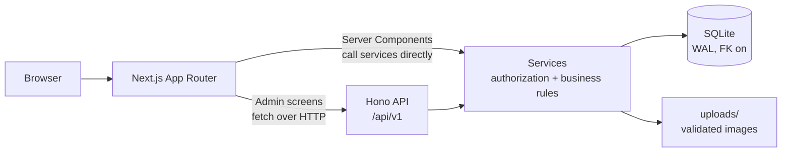
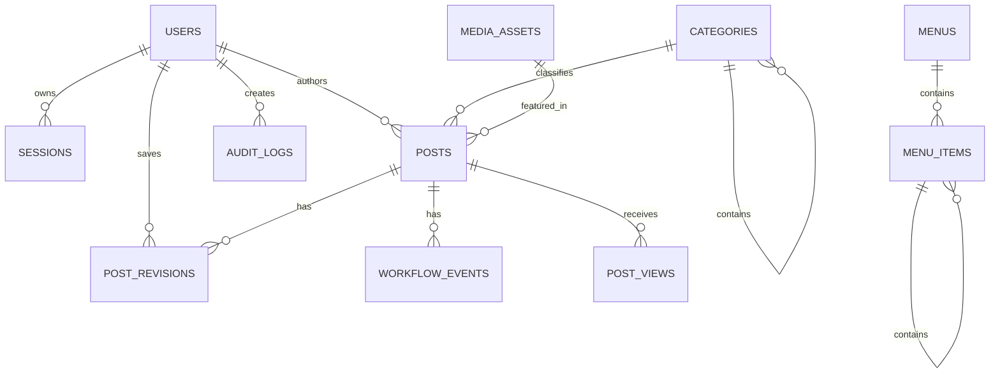
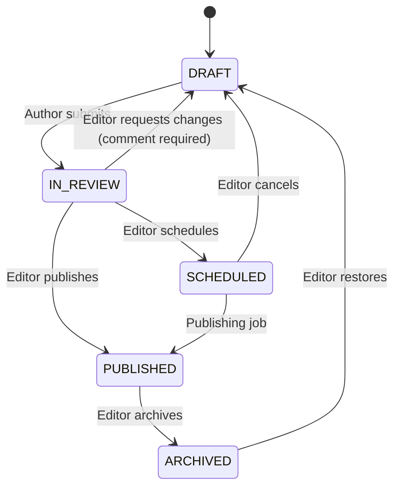

# PublishFlow CMS

A focused editorial CMS for small teams: draft, review, schedule and publish
articles with real revision history, role-based permissions and conflict-safe
editing.

Built with Next.js 16 (App Router), Hono, Drizzle ORM and SQLite.

---

## 1. Preview

```text
Public site                          Admin dashboard
┌──────────────────────────┐         ┌──────────────────────────────────┐
│  PublishFlow             │         │  Dashboard                       │
│  ────────────────────────│         │  ┌────┬────┬────┬────┬────┐      │
│  Engineering  News  Docs │         │  │ 3  │ 1  │ 1  │ 7  │ 42 │      │
│                          │         │  │Drft│Rvw │Schd│Pub │Rds │      │
│  ▸ Optimistic locking    │         │  └────┴────┴────┴────┴────┘      │
│    in practice           │         │                                  │
│    Engineering · 5 Aug   │         │  Recently edited    Activity     │
│                          │         │  ▸ Draft v3         Marco moved  │
│  ▸ Why an editorial      │         │  ▸ Published v7     draft →      │
│    workflow beats a      │         │  ▸ In review v2     in review    │
│    shared folder         │         │                                  │
└──────────────────────────┘         └──────────────────────────────────┘
```

Sign in at `/admin`. The public site lives at `/`.

---

## 2. The problem it solves

Small teams usually start with a shared folder and a chat thread. That breaks in
five predictable ways, and each one has a direct answer here:

| Problem                                                     | How PublishFlow answers it                                                                                              |
| ----------------------------------------------------------- | ----------------------------------------------------------------------------------------------------------------------- |
| Drafts get published before anyone reviews them             | A server-enforced workflow. An author **cannot** publish, even by calling the API directly.                             |
| Two people edit the same article and one save silently wins | Optimistic locking on a `version` column. A stale save returns `409` and keeps the typed text on screen.                |
| Nobody can tell what changed, or undo a bad edit            | Append-only revision history with preview, line-by-line comparison and restore.                                         |
| Navigation links rot when content is archived               | Menu items resolve through the live content; anything unpublished, archived or deleted is dropped from the public menu. |
| Refreshing a page inflates the read count                   | Reads are de-duplicated per browser, per post, per UTC day. No IP address is stored.                                    |

Plus an audit log of who published, archived, restored or deleted what.

---

## 3. Features

**Editorial**

- Post lifecycle: Draft → In review → Published → Archived, with scheduling.
- Revision history: every save snapshots the post; restore writes the old content
  forward as a new version and never deletes history.
- Optimistic locking on every mutation, including workflow transitions.
- Markdown editor with a formatting toolbar and live preview.
- Review notes: returning a post to draft requires an explanatory comment.

**Administration**

- Three roles — Admin, Editor, Author — enforced in the service layer.
- User management with a last-active-administrator safeguard.
- Category management with cycle and depth validation.
- Header/footer menu builder with accessible keyboard reordering and atomic saves.
- Image media library with strict upload validation.
- Site settings: name, logo, default SEO, posts per page, timezone.
- Audit log with filtering.

**Public site**

- Home, post, category and search pages.
- SEO metadata, canonical URLs, Open Graph, `sitemap.xml` and `robots.txt`.
- SQLite FTS5 full-text search with a tested `LIKE` fallback.
- De-duplicated read counting.

**Engineering**

- Versioned REST API under `/api/v1` with generated OpenAPI docs.
- 248 unit and integration tests, 12 Playwright end-to-end tests.
- Docker image, Compose stack with persistent volumes, and a verified backup script.

---

## 4. Architecture

A **modular monolith**. The domain is not large enough to justify services, and
one process keeps transactions straightforward.



Two deliberate rules:

- **Public pages are Server Components that call services directly.** No HTTP
  request back into the same process.
- **Admin screens call the Hono API.** The same API an external client would
  use, so authorization is exercised by the UI exactly as it would be by curl.

Route handlers stay thin. Every permission check, transaction and invariant
lives in `src/server/services/`.

### Data model



### Post lifecycle



More detail in [`docs/architecture-decisions.md`](docs/architecture-decisions.md).

---

## 5. Technology

| Area        | Choice                                | Why                                                                    |
| ----------- | ------------------------------------- | ---------------------------------------------------------------------- |
| Framework   | Next.js 16 (App Router)               | Server Components for the public site, one deployment unit             |
| API         | Hono under `/api/v1`                  | Small, fast, mounts cleanly in a catch-all route; same origin, no CORS |
| Database    | SQLite + Drizzle ORM + better-sqlite3 | Zero setup, real transactions and constraints, FTS5                    |
| Auth        | Opaque DB-backed session cookie       | Instantly revocable, unlike a stateless JWT                            |
| Passwords   | Argon2id (19 MiB, t=2, p=1)           | Current OWASP baseline                                                 |
| Validation  | Zod                                   | One schema drives validation _and_ the OpenAPI document                |
| Styling     | Tailwind CSS v4                       | Consistent spacing and accessible defaults                             |
| Client data | TanStack Query                        | Cache invalidation after mutations                                     |
| Testing     | Vitest + Playwright                   | Fast unit/integration, real-browser E2E                                |

---

## 6. Prerequisites

- **Node.js 24** (see `.nvmrc`). Node 22.11+ also works.
- **pnpm** — `corepack enable`
- A C toolchain is only needed if a prebuilt binary is unavailable for
  `better-sqlite3`, `argon2` or `sharp` on your platform.

---

## 7. Quick start

```bash
pnpm install
cp .env.example .env
pnpm db:migrate
pnpm db:seed
pnpm dev
```

Open <http://localhost:3000> for the public site and
<http://localhost:3000/admin> to sign in.

> Generate real secrets before doing anything beyond local development:
>
> ```bash
> node -e "console.log(require('crypto').randomBytes(32).toString('hex'))"
> ```
>
> The app refuses to start in production with the placeholder values.

---

## 8. Environment variables

Every variable is validated at startup; the process exits with a clear message
if one is missing or malformed.

| Variable                           | Default                 | Purpose                                            |
| ---------------------------------- | ----------------------- | -------------------------------------------------- |
| `NODE_ENV`                         | `development`           | Enables production hardening when `production`     |
| `APP_URL`                          | `http://localhost:3000` | Canonical URL; also the CSRF origin allow-list     |
| `DATABASE_PATH`                    | `./data/publishflow.db` | SQLite file, resolved to an absolute path          |
| `UPLOAD_DIR`                       | `./uploads`             | Media directory, outside the source tree           |
| `SESSION_COOKIE_NAME`              | `pf_session`            | `__Host-` prefixed automatically over HTTPS        |
| `SESSION_TTL_HOURS`                | `168`                   | Session lifetime                                   |
| `SESSION_SECRET`                   | —                       | **Required.** HMAC key for session token hashes    |
| `CSRF_SECRET`                      | —                       | **Required.** Signing key for CSRF tokens          |
| `VIEWER_HASH_SECRET`               | —                       | **Required.** HMAC key for visitor hashes          |
| `SCHEDULE_JOB_SECRET`              | —                       | **Required.** Bearer secret for the publishing job |
| `MAX_JSON_BYTES`                   | `1048576`               | JSON request body cap                              |
| `MAX_UPLOAD_BYTES`                 | `5242880`               | Upload size cap                                    |
| `TRUST_PROXY`                      | `false`                 | Trust `X-Forwarded-For` (only behind a real proxy) |
| `ENABLE_FTS`                       | `true`                  | Use FTS5 when the SQLite build supports it         |
| `SITE_TIMEZONE`                    | `UTC`                   | Default display timezone                           |
| `LOG_LEVEL`                        | `info`                  | `debug` \| `info` \| `warn` \| `error` \| `silent` |
| `SEED_*_EMAIL` / `SEED_*_PASSWORD` | see `.env.example`      | Development seed accounts                          |

---

## 9. Database commands

```bash
pnpm db:migrate    # apply pending migrations
pnpm db:seed       # deterministic demo data, safe to re-run
pnpm db:reset      # delete the local database file (refuses in production)
pnpm db:check      # PRAGMA quick_check, foreign_key_check + app invariants
pnpm db:generate   # regenerate Drizzle artefacts after a schema change
```

Migrations are plain SQL in `drizzle/`, applied in filename order and recorded in
`__migrations`. Each file runs in one transaction, so a failure leaves the
schema on the previous version.

---

## 10. Demo accounts

**Development only.** Passwords come from `.env`; the values below are the
`.env.example` defaults.

| Role            | Email                       | Password                  |
| --------------- | --------------------------- | ------------------------- |
| Admin           | `admin@publishflow.local`   | `AdminDemo123!ChangeMe`   |
| Editor          | `editor@publishflow.local`  | `EditorDemo123!ChangeMe`  |
| Author          | `author@publishflow.local`  | `AuthorDemo123!ChangeMe`  |
| Author (second) | `author2@publishflow.local` | `Author2Demo123!ChangeMe` |

The second author exists so ownership rules can be demonstrated: neither author
can see or edit the other's drafts.

---

## 11. Tests and quality gates

```bash
pnpm check          # format:check + lint + typecheck + test + build
pnpm test           # unit + integration (Vitest)
pnpm test:unit
pnpm test:integration
pnpm test:coverage
pnpm test:e2e       # Playwright (run `pnpm build` first)
pnpm test:e2e:ui
```

`pnpm test:e2e` builds its own throwaway database under `.e2e/`, so it never
touches your development data.

What is covered:

- **Unit** — permission matrix, every workflow transition, slug rules, URL-scheme
  safety, tree cycle/depth validation, pagination and sort allow-listing, viewer
  day keys, password policy, FTS query escaping, and that Markdown cannot execute
  raw HTML.
- **Integration** — the full API through the real Hono app: authentication,
  ownership, version conflicts, revision restore, upload rejection (spoofed
  extensions, wrong magic bytes, oversized files, SVG), atomic menu reordering,
  read de-duplication, scheduled publishing idempotency, CSRF, and the OpenAPI
  document.
- **End-to-end** — the editorial round trip, a real two-context save conflict,
  revision restore reflected publicly, settings and menu changes reaching the
  public header, read de-duplication across browsers, and authorization.

---

## 12. API documentation

| Location                     | Contents                                        |
| ---------------------------- | ----------------------------------------------- |
| `/api/v1/openapi.json`       | Generated OpenAPI 3.1 document                  |
| `/api/v1/docs`               | Interactive Swagger UI                          |
| [`docs/api.md`](docs/api.md) | Endpoint catalogue, conventions and error codes |

Conventions: `{ "data": … }` for a single resource, `{ "data": [], "meta": {…} }`
for a list, and `{ "error": { code, message, details?, requestId } }` for
failures. Every response carries `X-Request-Id`.

---

## 13. Docker

```bash
cp .env.example .env          # then replace every "replace-with-..." value
docker compose up --build -d
docker compose run --rm app node docker/seed.mjs   # create the first admin
```

The stack runs the app plus a scheduler sidecar that publishes due posts once a
minute. Three named volumes persist across restarts and rebuilds:

| Volume        | Mount          | Contents         |
| ------------- | -------------- | ---------------- |
| `cms_data`    | `/app/data`    | SQLite database  |
| `cms_uploads` | `/app/uploads` | Uploaded images  |
| `cms_backups` | `/app/backups` | Backup snapshots |

The image runs as the non-root `node` user, applies migrations on startup, and
exposes a health check at `/api/v1/health`.

> **One replica only.** SQLite permits a single writer and the uploads live on a
> local volume. Scaling out needs PostgreSQL (or libSQL/Turso) plus object
> storage — see §16.

To verify persistence:

```bash
docker compose restart app
curl -s localhost:3000/api/v1/health   # {"status":"ok","database":"ok"}
```

### Deploying a demo to Render Free

`render.yaml` is a Blueprint that deploys this same Docker image to Render's
free instance type.

> ### ⚠️ Nothing you create on Render Free survives a restart
>
> The free instance type has **no persistent disk**. The SQLite database at
> `/app/data` and the uploaded images at `/app/uploads` live inside the
> container filesystem, which Render destroys on every **redeploy, restart, and
> automatic spin-down after ~15 minutes of inactivity**. Posts you write, images
> you upload and read counts you accumulate are all gone when the container
> recycles — and the first request after a spin-down takes ~30–60 seconds while
> it cold-starts.
>
> This is a demo target only. For anything real, use a paid instance type with a
> persistent disk mounted at `/app/data` and `/app/uploads`, or migrate to
> PostgreSQL plus object storage (§16).

Because the filesystem is ephemeral, the deployment sets `DEMO_SEED=true`. The
container entrypoint then runs, in order: environment validation → migrations →
the demo seed → the server. The seed is the same one `pnpm db:seed` runs and is
**idempotent** — every record is looked up by its natural key and updated rather
than inserted — so it repopulates an empty database without ever resetting one
that already has content.

**Deploy:**

1. Push this branch to GitHub.
2. Render → **New → Blueprint** → select the repository. It reads `render.yaml`.
3. Render prompts for the values marked `sync: false`. Set the four
   `SEED_*_PASSWORD` values (any string of 12+ characters), and set `APP_URL`
   to `https://<your-service>.onrender.com` once Render shows you the URL.
   The four cryptographic secrets are generated by Render automatically.
4. Deploy. First build takes several minutes — the image compiles three native
   addons.

If `APP_URL` is wrong the app still runs (CSRF falls back to the `Host` header),
but canonical URLs, Open Graph tags and `sitemap.xml` will point at the wrong
origin. Startup fails outright if `APP_URL` is missing or is not `https://`.

Sign in at `https://<your-service>.onrender.com/admin` with the seeded admin
address and the password you set.

---

## 14. Backup and restore

```bash
./scripts/backup-db.sh                        # local
docker compose exec app ./scripts/backup-db.sh  # container
```

The script uses SQLite's `.backup` command, not `cp`: copying a live WAL-mode
database can capture a torn page or miss committed data still in the `-wal`
file. Each snapshot is integrity-checked with `PRAGMA quick_check` before it is
compressed, and snapshots older than `RETENTION_DAYS` (default 14) are pruned.

To restore:

1. `docker compose stop app`
2. `gunzip -c backups/publishflow-<timestamp>.db.gz > data/publishflow.db`
3. `rm -f data/publishflow.db-wal data/publishflow.db-shm`
4. `docker compose start app`

---

## 15. Security

Full detail in [`docs/security.md`](docs/security.md). In brief:

- **Passwords** — Argon2id at the OWASP baseline. Never logged or returned.
- **Sessions** — opaque random token; only its HMAC is stored, so a database
  leak alone cannot be replayed. Revocation is immediate.
- **CSRF** — three independent layers: `Origin` allow-listing, `Sec-Fetch-Site`,
  and a signed session-bound double-submit token.
- **Authorization** — enforced in services, verified by tests that call the API
  directly rather than clicking buttons.
- **XSS** — content is Markdown rendered without raw HTML support.
  `dangerouslySetInnerHTML` appears nowhere in the codebase.
- **Uploads** — real type detected from magic bytes and confirmed by decoding;
  the image is re-encoded (stripping EXIF and any appended payload); the storage
  key is generated, never derived from the filename. SVG is rejected.
- **SQL** — Drizzle bindings throughout. Sort fields resolve through an
  allow-list; user input never becomes a column name.
- **Rate limiting** — database-backed login throttling plus per-process limits on
  uploads and view counting.
- **Errors** — domain errors map to stable codes; everything else becomes a
  generic `500`. No stack traces, SQL or secrets reach a client.

---

## 16. Trade-offs

**SQLite.** Right for a read-heavy CMS on one instance: transactions,
constraints, FTS5 and no operational overhead. Wrong for multiple write-heavy
replicas — SQLite allows one writer at a time. PostgreSQL would be the migration
target; Drizzle keeps most query code portable.

**Local file uploads.** Simple and reviewable. Incompatible with ephemeral
serverless filesystems — a Vercel-style deployment would lose both the database
and the uploads on every cold start. Use a VM or container with persistent
volumes, or move media to S3-compatible storage behind the existing service
interface.

**Optimistic locking over row locking.** Editorial conflicts are rare; detecting
them is far cheaper than holding locks, and there is no story needed for a
browser tab closed mid-edit.

**Sessions over JWTs.** Immediate revocation matters more here than statelessness.
Disabling a user or changing a password invalidates live sessions in the same
transaction.

**Bounded in-process rate limiting.** Correct for one instance, and honest about
it: multiple replicas would need a shared store.

**Two-level nesting for categories and menus.** Deeper trees mean recursive
queries and a much harder UI, for a case this product does not have.

---

## 17. Project structure

```text
src/
├── app/
│   ├── (public)/          # public site — Server Components calling services
│   ├── admin/             # admin shell; (protected)/ sits behind the session gate
│   └── api/[[...route]]/  # thin Hono adapter
├── components/            # ui/ primitives, admin/ screens, public/ pieces
├── client/                # typed fetch wrapper + query keys
├── lib/                   # pure domain logic (permissions, workflow, slugs, trees)
└── server/
    ├── auth/              # passwords, sessions, CSRF
    ├── contracts/         # Zod schemas shared by validation and OpenAPI
    ├── db/                # schema, migrator, seed
    ├── http/              # Hono app, middleware, routes
    └── services/          # business rules, transactions, authorization
drizzle/                   # SQL migrations
docker/                    # entrypoint, production migration runner, bootstrap
docs/                      # architecture, API, security, demo script
tests/                     # unit, integration, e2e
```

The interesting logic is in `src/lib/` (pure, heavily unit-tested) and
`src/server/services/` (transactions and authorization).

---

## 18. Demo walkthrough

A five-minute tour is scripted in [`docs/demo-script.md`](docs/demo-script.md):
publish an article, trigger a real save conflict, restore a revision, reorder a
menu and watch the public header change, and show reads being de-duplicated.

---

## 19. Future improvements

Deliberately out of scope, in rough priority order:

1. **Tags** alongside categories, for cross-cutting classification.
2. **Autosave** with a per-editor draft buffer, so a conflict never risks typed text.
3. **PostgreSQL support** — mostly a Drizzle dialect swap plus a migration path.
4. **S3-compatible media storage** behind the existing service interface.
5. **Password reset by email**, once there is an email service to rely on.
6. **Responsive image variants** generated on upload.
7. **Import/export** as Markdown with front matter.
8. **Dark mode** — the token layer is already in place.

---

## 20. License

Provided as an assignment deliverable.
